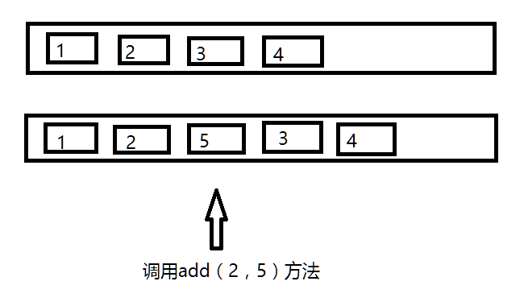

# ArrayList
### 前言

```
ArrayList是一个数组队列，相当于动态数组。与Java中的数组相比，它的容量能动态增长。
和Vector不同，ArrayList中的操作不是线程安全的！所以，建议在单线程中使用ArrayList。

```

## ArrayList属性

```
public class ArrayList<E> extends AbstractList<E>
        implements List<E>, RandomAccess, Cloneable, java.io.Serializable
{
    private static final long serialVersionUID = 8683452581122892189L;

    /**
     * Default initial capacity.
     */
    private static final int DEFAULT_CAPACITY = 10;

    /**
     * Shared empty array instance used for empty instances.
     */
    private static final Object[] EMPTY_ELEMENTDATA = {};

    /**
     * Shared empty array instance used for default sized empty instances. We
     * distinguish this from EMPTY_ELEMENTDATA to know how much to inflate when
     * first element is added.
     */
    private static final Object[] DEFAULTCAPACITY_EMPTY_ELEMENTDATA = {};

    /**
     * The array buffer into which the elements of the ArrayList are stored.
     * The capacity of the ArrayList is the length of this array buffer. Any
     * empty ArrayList with elementData == DEFAULTCAPACITY_EMPTY_ELEMENTDATA
     * will be expanded to DEFAULT_CAPACITY when the first element is added.
     */
    transient Object[] elementData; // non-private to simplify nested class access

    /**
     * The size of the ArrayList (the number of elements it contains).
     *
     * @serial
     */
    private int size;
    
```
> <font size=4 color="black"> ArrayList类说明：</font>
> 
> * ArrayList继承了AbstractList，实现了List;它是一个数组队列，提供了相关的添加、删除、修改、遍历等功能。
> * ArrayList实现了RandmoAccess接口，提供了随机访问功能；RandmoAccess是java中用来被List实现，为List提供快速访问功能的，即ArrayList可以通过元素的序号快速获取元素对象。
> * ArrayList实现了Cloneable接口，即覆盖了函数clone()，能被克隆。
> * ArrayList实现java.io.Serializable接口，支持序列化，能通过序列化去传输。
> 
> <font size=4 color="black"> ArrayList类属性：</font>
> 
> * size：当前数组长度
> * elementData：存放数组的对象数组
> * modCount：ArrayList集合的修改次数(从AbstractList继承过来)

<br/>

## ArrayList构造函数
* <font size=5 > 无参构造函数 </font>

```
	/**
     * Constructs an empty list with an initial capacity of ten.
     */
    public ArrayList() {
        this.elementData = DEFAULTCAPACITY_EMPTY_ELEMENTDATA;
    }

```

<font color="red" size=3> 注意：</font>创建的ArrayList对象中的elementData中的长度是1，size是0,当进行第一次add的时候，elementData将会变成默认的长度：10。

* <font size=5 > 带int类型的构造函数 </font>

```
	/**
     * Constructs an empty list with the specified initial capacity.
     *
     * @param  initialCapacity  the initial capacity of the list
     * @throws IllegalArgumentException if the specified initial capacity
     *         is negative
     */
    public ArrayList(int initialCapacity) {
        if (initialCapacity > 0) {
            this.elementData = new Object[initialCapacity];
        } else if (initialCapacity == 0) {
            this.elementData = EMPTY_ELEMENTDATA;
        } else {
            throw new IllegalArgumentException("Illegal Capacity: "+
                                               initialCapacity);
        }
    }
```


* <font size=5 > 带Collection对象的构造函数 </font>

```
    /**
     * Constructs a list containing the elements of the specified
     * collection, in the order they are returned by the collection's
     * iterator.
     *
     * @param c the collection whose elements are to be placed into this list
     * @throws NullPointerException if the specified collection is null
     */
    public ArrayList(Collection<? extends E> c) {
        elementData = c.toArray();
        if ((size = elementData.length) != 0) {
            // c.toArray might (incorrectly) not return Object[] (see 6260652)
            if (elementData.getClass() != Object[].class)
                elementData = Arrays.copyOf(elementData, size, Object[].class);
        } else {
            // replace with empty array.
            this.elementData = EMPTY_ELEMENTDATA;
        }
    }

```
>
><font size=4 color="black"> 执行说明：</font>
>
> * 将collection对象转换成数组，然后将数组的地址的赋给elementData。
> * 更新size的值，同时判断size的大小，如果是size等于0，直接将空对象EMPTY_ELEMENTDATA的地址赋给elementData。
> * 如果size的值大于0，则执行Arrays.copy方法，把collection对象的内容（可以理解为深拷贝）copy到elementData中。
> 
> > <font size=3 color="red"> 注意：</font>
> > 
> > * 浅拷贝：指对象引用复制<font color="black">【c.toArray()】</font>
> > * 深拷贝：指对象的引用和具体值一起复制（相比于浅拷贝速度较慢并且花销较大）<font color="black">【Arrays.copyOf】</font>

<br/>

## ArrayList方法
* <font size=5 > add方法 </font>

>
> * <font size=4 color="black"> add(E e) </font>
> 
> > <font size=3 color="black"> 执行逻辑：</font>
> > 
> > * 确保数组已使用长度（size）加1之后足够存下 下一个数据
> > * 修改次数modCount 标识自增1，如果当前数组已使用长度（size）加1后的大于当前的数组长度，则调用grow方法，增长数组，grow方法会将当前数组的长度变为原来容量的1.5倍。
> > * 确保新增的数据有地方存储之后，则将新元素添加到位于size的位置上。
> > * 返回添加成功布尔值。
> > 
> > ```
> >     /**
     * Appends the specified element to the end of this list.
     *
     * @param e element to be appended to this list
     * @return <tt>true</tt> (as specified by {@link Collection#add})
     */
    public boolean add(E e) {
        ensureCapacityInternal(size + 1);  // Increments modCount!!
        elementData[size++] = e;
        return true;
    }
> > 
> > 	private void ensureCapacityInternal(int minCapacity) {
        ensureExplicitCapacity(calculateCapacity(elementData, minCapacity));
    }
> > 
> > 	private static int calculateCapacity(Object[] elementData, int minCapacity) {
        if (elementData == DEFAULTCAPACITY_EMPTY_ELEMENTDATA) {
            return Math.max(DEFAULT_CAPACITY, minCapacity);
        }
        return minCapacity;
    }
> > 
> > 	private void ensureExplicitCapacity(int minCapacity) {
        modCount++;
	// overflow-conscious code
        if (minCapacity - elementData.length > 0)
            grow(minCapacity);
    }
> > 
> > 	/**
     * Increases the capacity to ensure that it can hold at least the
     * number of elements specified by the minimum capacity argument.
     *
     * @param minCapacity the desired minimum capacity
     */
    private void grow(int minCapacity) {
        // overflow-conscious code
        int oldCapacity = elementData.length;
        int newCapacity = oldCapacity + (oldCapacity >> 1);
        if (newCapacity - minCapacity < 0)
            newCapacity = minCapacity;
        if (newCapacity - MAX_ARRAY_SIZE > 0)
            newCapacity = hugeCapacity(minCapacity);
        // minCapacity is usually close to size, so this is a win:
        elementData = Arrays.copyOf(elementData, newCapacity);
    }
> > 
> > ```
> > 
>
> 
> 
> * <font size=4 color="black"> add(int index, E element) </font>
> 
> > <font size=3 color="black"> 执行逻辑：</font>
> >
> > * 确保数插入的位置小于等于当前数组长度，并且不小于0，否则抛出异常
> > * 确保数组已使用长度（size）加1之后足够存下 下一个数据
> > * 修改次数（modCount）标识自增1，如果当前数组已使用长度（size）加1后的大于当前的数组长度，则调用grow方法，增长数组
> > * grow方法会将当前数组的长度变为原来容量的1.5倍。
> > * 确保有足够的容量之后，使用System.arraycopy 将需要插入的位置（index）后面的元素统统往后移动一位。
> > * 将新的数据内容存放到数组的指定位置（index）上
> > 
> > ```
> > 	/**
     * Inserts the specified element at the specified position in this
     * list. Shifts the element currently at that position (if any) and
     * any subsequent elements to the right (adds one to their indices).
     *
     * @param index index at which the specified element is to be inserted
     * @param element element to be inserted
     * @throws IndexOutOfBoundsException {@inheritDoc}
     */
    public void add(int index, E element) {
        rangeCheckForAdd(index);
		ensureCapacityInternal(size + 1);  // Increments modCount!!
        System.arraycopy(elementData, index, elementData, index + 1,
                         size - index);
        elementData[index] = element;
        size++;
    }
> > ```
> > <font size=3 color="red">注意：</font>使用该方法的话将导致指定位置后面的数组元素全部重新移动，即往后移动一位。
> > 

* <font size=5 > get方法 </font>

> 
> 获取指定位置上的元素
> 
> > 
> > ```
> > 	public E get(int index) {
            rangeCheck(index);
            checkForComodification();
            return ArrayList.this.elementData(offset + index);
        }
> > 
> > ```


* <font size=5 > set方法 </font>

> 
> 确保set的位置小于当前数组的长度（size）并且大于0，获取指定位置（index）元素，然后放到oldValue存放，将需要设置的元素放到指定的位置（index）上，然后将原来位置上的元素oldValue返回给。
> 
> > 
> > ```
> > 	public E set(int index, E e) {
            rangeCheck(index);
            checkForComodification();
            E oldValue = ArrayList.this.elementData(offset + index);
            ArrayList.this.elementData[offset + index] = e;
            return oldValue;
        }
> > ```

* <font size=5 > contains方法 </font>

> 
> 调用indexOf方法，遍历数组中的每一个元素作对比，如果找到对于的元素，则返回true，没有找到则返回false。
> 
> >
> >```
> >	    public boolean contains(Object o) {
	        return indexOf(o) >= 0;
	    }
> > 	
> > 	public int indexOf(Object o) {
        if (o == null) {
            for (int i = 0; i < size; i++)
                if (elementData[i]==null)
                    return i;
        } else {
            for (int i = 0; i < size; i++)
                if (o.equals(elementData[i]))
                    return i;
        }
        return -1;
    }  
> >```
> >

* <font size=5 > remove方法 </font>

>
> * <font size=4 color="black"> 根据索引remove </font>
> 
> > <font size=3 color="black"> 执行逻辑：</font>
> > 
> > * 判断索引有没有越界
> > * 自增修改次数
> > * 将指定位置（index）上的元素保存到oldValue
> > * 将指定位置（index）上的元素都往前移动一位
> > * 将最后面的一个元素置空，好让垃圾回收器回收
> > * 将原来的值oldValue返回
> > 
> > ```
> >  	public E remove(int index) {
        rangeCheck(index);
		modCount++;
        E oldValue = elementData(index);
	 	int numMoved = size - index - 1;
        if (numMoved > 0)
            System.arraycopy(elementData, index+1, elementData, index,
                             numMoved);
        elementData[--size] = null; // clear to let GC do its work
		return oldValue;
    }
> > 
> > ```
> > <font size=3 color="red">注意：</font>这个方法不会缩减数组的长度，只是将最后一个数组元素置空。
> 
> * <font size=4 color="black"> 根据对象remove </font>
> 
> > <font size=3 color="black"> 执行逻辑：</font>
> > 
> > * 循环遍历所有对象，得到对象所在索引位置，然后调用fastRemove方法，执行remove操作
> > * 定位到需要remove的元素索引，先将index后面的元素往前面移动一位（调用System.arraycooy实现），然后将最后一个元素置空。
> >
> >```
> >		public boolean remove(Object o) {
        if (o == null) {
            for (int index = 0; index < size; index++)
                if (elementData[index] == null) {
                    fastRemove(index);
                    return true;
                }
        } else {
            for (int index = 0; index < size; index++)
                if (o.equals(elementData[index])) {
                    fastRemove(index);
                    return true;
                }
        }
        return false;
    }
> >
> >		/*
     * Private remove method that skips bounds checking and does not
     * return the value removed.
     */
    private void fastRemove(int index) {
        modCount++;
        int numMoved = size - index - 1;
        if (numMoved > 0)
            System.arraycopy(elementData, index+1, elementData, index,
                             numMoved);
        elementData[--size] = null; // clear to let GC do its work
    }
> >
> >```

* <font size=5 > clear方法 </font>

> 
> 添加操作次数（modCount），将数组内的元素都置空，等待垃圾收集器收集，不减小数组容量。
> 
> ```
>     /**
     * Removes all of the elements from this list.  The list will
     * be empty after this call returns.
     */
    public void clear() {
        modCount++;
        // clear to let GC do its work
        for (int i = 0; i < size; i++)
            elementData[i] = null;
        size = 0;
    }
> ```

* <font size=5 > iterator方法 </font>

> 
> ```
> 	public Iterator<E> iterator() {
        return new Itr();
    }
> 
>     /**
     * An optimized version of AbstractList.Itr
     */
    private class Itr implements Iterator<E> {
        int cursor;       // index of next element to return
        int lastRet = -1; // index of last element returned; -1 if no such
        int expectedModCount = modCount;
         Itr() {}
         public boolean hasNext() {
            return cursor != size;
        }
        @SuppressWarnings("unchecked")
        public E next() {
            checkForComodification();
            int i = cursor;
            if (i >= size)
                throw new NoSuchElementException();
            Object[] elementData = ArrayList.this.elementData;
            if (i >= elementData.length)
                throw new ConcurrentModificationException();
            cursor = i + 1;
            return (E) elementData[lastRet = i];
        }
        public void remove() {
            if (lastRet < 0)
                throw new IllegalStateException();
            checkForComodification();
			try {
                ArrayList.this.remove(lastRet);
                cursor = lastRet;
                lastRet = -1;
                expectedModCount = modCount;
            } catch (IndexOutOfBoundsException ex) {
                throw new ConcurrentModificationException();
            }
        }
		@Override
        @SuppressWarnings("unchecked")
        public void forEachRemaining(Consumer<? super E> consumer) {
            Objects.requireNonNull(consumer);
            final int size = ArrayList.this.size;
            int i = cursor;
            if (i >= size) {
                return;
            }
            final Object[] elementData = ArrayList.this.elementData;
            if (i >= elementData.length) {
                throw new ConcurrentModificationException();
            }
            while (i != size && modCount == expectedModCount) {
                consumer.accept((E) elementData[i++]);
            }
            // update once at end of iteration to reduce heap write traffic
            cursor = i;
            lastRet = i - 1;
            checkForComodification();
        }
		final void checkForComodification() {
            if (modCount != expectedModCount)
                throw new ConcurrentModificationException();
        }
    }
> 
> ```
> <font size=3 color="red">注意：</font>
> 
> * 使用next做遍历的时候可能会引发ConcurrentModificationException，当修改次数与期望的修改次数（调用iterator方法时候的修改次数）不一致的时候，会发生该异常
> * expectedModCount是在用户调用ArrayList的iterator方法时确定的，如果在这之后调用add、remove方法，modCount就会随之改变，那么这个值就会不相等，将会引发ConcurrentModificationException异常（常见于多线程场景下）
> 


## 总结
* 线程不安全
* ArrayList实现了序列化和反序列化【writeObject(java.io.ObjectOutputStream s)和 	private void readObject(java.io.ObjectInputStream s)】
* ArrayList基于数组方式实现，无容量的限制（会扩容）
* remove(Object o)和 contains(E)需要遍历数组
* 删除元素时，将删除掉的位置元素置为null，不会减少容量（trimToSize()可减少容量）。（下次gc回收元素所占的内存空间）


# 参考资料

* [浅拷贝&深拷贝(参考一)](https://blog.csdn.net/baiye_xing/article/details/71788741)

* [浅拷贝&深拷贝(参考二)](https://blog.csdn.net/slowlifes/article/details/78186919)


