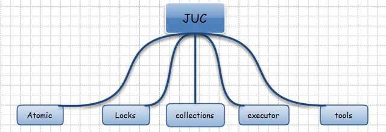
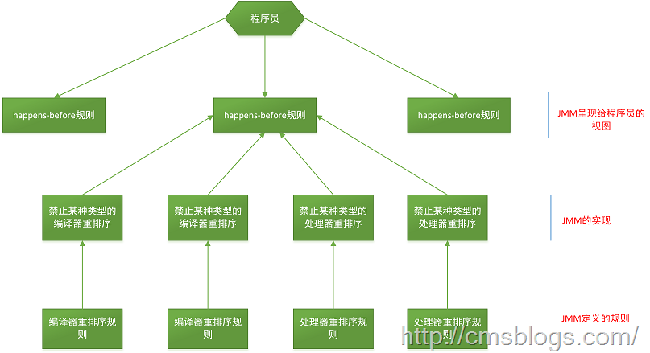
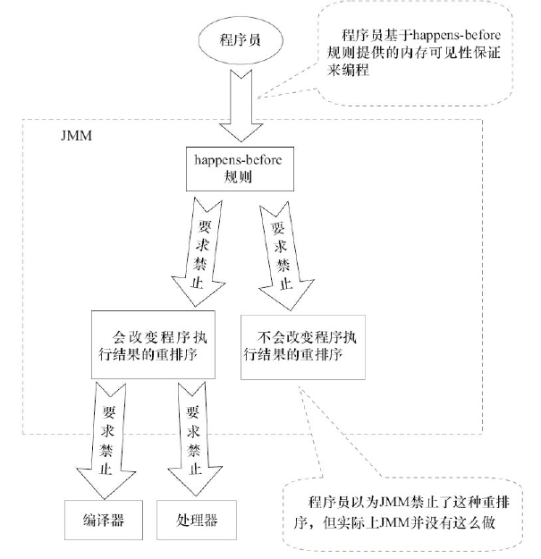

# JUC基础概念

#### Java JUC包的主体结构

* Atomic : AtomicInteger 
* Locks : Lock, Condition, ReadWriteLock
* Collections : Queue, ConcurrentMap
* Executer : Future, Callable, Executor
* Tools : CountDownLatch, CyclicBarrier, Semaphore

### 一、原子操作
多个线程执行一个操作时，其中任何一个线程要么完全执行完此操作，要么没有执行此操作的任何步骤，那么这个操作就是原子的。出现原因: synchronized的代价比较高。

* 以AtomicInteger为例就是通过加锁等方式实现线程安全的计算或者传入期望值与计算结果进行比较，不满足期望值则失败。

### 二、指令重排
在计算机执行指令的顺序在经过程序编译器编译之后形成的指令序列，一般而言，这个指令序列是会输出确定的结果；以确保每一次的执行都有确定的结果。但是，一般情况下，CPU和编译器为了提升程序执行的效率，会按照一定的规则允许进行指令优化，在某些情况下，这种优化会带来一些执行的逻辑问题，主要的原因是代码逻辑之间是存在一定的先后顺序，在并发执行情况下，会发生二义性，即按照不同的执行逻辑，会得到不同的结果信息。

* 指令重排的原因分析
 *  主要还是编译器以及CPU为了优化代码或者执行的效率而执行的优化操作；应用条件是单线程场景下，对于并发多线程场景下，指令重排会产生不确定的执行效果。
* 如何防止指令重排
 * volatile关键字可以保证变量的可见性，因为对volatile的操作都在Main Memory中，而Main Memory是被所有线程所共享的，这里的代价就是牺牲了性能，无法利用寄存器或Cache，因为它们都不是全局的，无法保证可见性，可能产生脏读。
 * volatile还有一个作用就是局部阻止重排序的发生，对volatile变量的操作指令都不会被重排序，因为如果重排序，又可能产生可见性问题。
 * 这里提到的可见性是指前一条程序指令的执行结果，可以被后一条指令读到或者看到，称之为可见性。反之为不可见性。这里主要描述的是在多线程环境下，指令语句之间对于结果信息的读取即时性。

### 三、Happens-before法则：（Java 内存模型）
如果动作B要看到动作A的执行结果（无论A/B是否在同一个线程里面执行），那么A/B就需要满足happens-before关系。happens-befor与JMM的关系图如下：

* Happens-before的几个规则：
 * Program order rule：同一个线程中的每个Action都happens-before于出现在其后的任何一个Action。
 * Monitor lock rule：对一个监视器的解锁happens-before于每一个后续对同一个监视器的加锁。
 * Volatile variable rule：对volatile字段的写入操作happens-before于每一个后续的同一个字段的读操作。
 * Thread start rule：Thread.start()的调用会happens-before于启动线程里面的动作。
 * Thread termination rule：Thread中的所有动作都happens-before于其他线程检查到此线程结束或者Thread.join（）中返回或者Thread.isAlive()==false。
 * Interruption rule：一个线程A调用另一个另一个线程B的interrupt（）都happens-before于线程A发现B被A中断（B抛出异常或者A检测到B的isInterrupted（）或者interrupted()）。
 * Finalizer rule：一个对象构造函数的结束happens-before与该对象的finalizer的开始。
 * Transitivity：如果A动作happens-before于B动作，而B动作happens-before与C动作，那么A动作happens-before于C动作。
 * 因为CPU是可以不按我们写代码的顺序执行内存的存取过程的，也就是指令会乱序或并行运行， 只有上面的happens-before所规定的情况下，才保证顺序性。
 
* JMM的设计示意图 
 
* JMM的特性：
 * 多个CPU之间的缓存也不保证实时同步；
 * JMM不保证创建过程的原子性，读写并发时，可能看到不完整的对象。（so D-check）

* volatile语义
 * volatile实现了类似synchronized的语义，却又没有锁机制。它确保对  volatile字段的更新以可预见的方式告知其他的线程。
 * Java 存储模型不会对volatile指令的操作进行重排序：这个保证对volatile变量的操作时按照指令的出现顺序执行的。
 * volatile变量不会被缓存在寄存器中（只有拥有线程可见），每次总是从主存中读取volatile变量的结果。
 * PS：volatile并不能保证线程安全的，也就是说volatile字段的操作不是原子性的，volatile变量只能保证可见性。

# 参考资料
* [原子操作](https://blog.csdn.net/jdliyao/article/details/78864178)
* [指令重排](https://blog.csdn.net/blueheart20/article/details/52117761)
* [Java内存模型之happens-before](https://www.cnblogs.com/chenssy/p/6393321.html)
* [Java并发编程之happens-before](https://www.cnblogs.com/senlinyang/p/7875458.html)
* [JUC (Java Util Concurrency) 基础内容概述](https://blog.csdn.net/china_wanglong/article/details/38828407)

