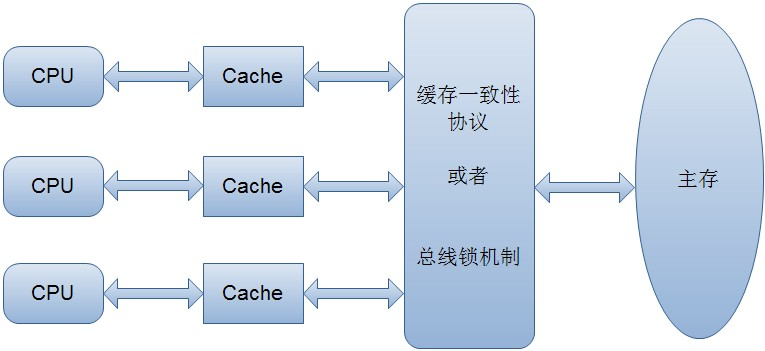

# volatile 关键字

### 前言

```
volatile 关键字主要有两个作用，一是保证可见性，二是保证有序性。该关键字主要在一些多线程需求场景下使用。
因为对volatile关键字的理解比较少，在网上找了一篇感觉相对详细的博文进行了抄袭，算是学习了。

```

## 内存模型的相关概念
```
计算机在执行程序时，每条指令都是在CPU中执行的，而执行指令过程中，势必涉及到数据的读取和写入。
由于程序运行过程中的临时数据是存放在主存（物理内存）当中的，这时就存在一个问题，
由于CPU执行速度很快，而从内存读取数据和向内存写入数据的过程跟CPU执行指令的速度比起来要慢的多，
因此如果任何时候对数据的操作都要通过和内存的交互来进行，会大大降低指令执行的速度。
因此在CPU里面就有了高速缓存。

```

* 多线程（即多个CPU）编程时，同一个变量就会存在主从不一致的现象了。通常有以下解决方式：
 * 通过在总线加LOCK#锁的方式（由于在锁住总线期间，其他CPU无法访问内存，导致效率低下。）
 * 通过缓存一致性协议（核心的思想是：当CPU写数据时，如果发现操作的变量是共享变量，即在其他CPU中也存在该变量的副本，会发出信号通知其他CPU将该变量的缓存行置为无效状态，因此当其他CPU需要读取这个变量时，发现自己缓存中缓存该变量的缓存行是无效的，那么它就会从内存重新读取。简化如下图）

 

## 二.并发编程中的三个概念

* <font size=5 > 原子性 </font>

```
 即一个操作或者多个操作 要么全部执行并且执行的过程不会被任何因素打断，要么就都不执行。
```

* <font size=5 > 可见性 </font>

```
 可见性是指当多个线程访问同一个变量时，一个线程修改了这个变量的值，其他线程能够立即看得到修改的值。
```

* <font size=5 > 有序性 </font>

```
 即程序执行的顺序按照代码的先后顺序执行。
```

## 使用volatile关键字的场景
synchronized关键字是防止多个线程同时执行一段代码，那么就会很影响程序执行效率，而volatile关键字在某些情况下性能要优于synchronized，但是要注意volatile关键字是无法替代synchronized关键字的，因为volatile关键字无法保证操作的原子性。通常来说，使用volatile必须具备以下2个条件：

 * 1）对变量的写操作不依赖于当前值
 * 2）该变量没有包含在具有其他变量的不变式中

 实际上，这些条件表明，可以被写入 volatile 变量的这些有效值独立于任何程序的状态，包括变量的当前状态。
 
 事实上，我的理解就是上面的2个条件需要保证操作是原子性操作，才能保证使用volatile关键字的程序在并发时能够正确执行。

# 参考资料

* [volatile关键字解析](https://www.cnblogs.com/dolphin0520/p/3920373.html)


 
 