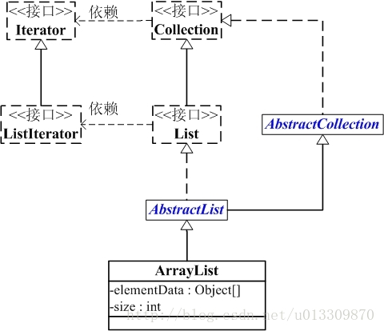

# ArrayList源码分析

## ArrayList原理简述
ArrayList底层比较简单，是一个动态数组，具体在后面代码分析会更深入理解。
## ArrayList继承关系
  

## ArrayList属性
```java
/**
 * 默认长度
 */
private static final int DEFAULT_CAPACITY = 10;

/**
 * 空实例共享的空数组
 */
private static final Object[] EMPTY_ELEMENTDATA = {};

/**
 *  默认大小的空实例共享的空数组
 */
private static final Object[] DEFAULTCAPACITY_EMPTY_ELEMENTDATA = {};

/**
 * 内部动态数组的维护
 */
transient Object[] elementData;

/**
 *  列表中实际存储的元素个数
 */
private int size;

```

## ArrayList构造方法
### 构造方法1
```java 
/**
 *  构造一个默认容量的空列表
 */
public ArrayList() {
    this.elementData = DEFAULTCAPACITY_EMPTY_ELEMENTDATA;
}
```

### 构造方法2
```java 
/**
 * 构造方法,可设定动态数组初始化长度
 */
public ArrayList(int initialCapacity) {
    if (initialCapacity > 0) {
        this.elementData = new Object[initialCapacity];
    } else if (initialCapacity == 0) {
        this.elementData = EMPTY_ELEMENTDATA;
    } else {
        throw new IllegalArgumentException("Illegal Capacity: "+
                initialCapacity);
    }
}
```

### 构造方法3
```java
/**
 * 构造一个包含集合C中所有元素的列表
 */
public ArrayList(Collection<? extends E> c) {
    elementData = c.toArray();
    if ((size = elementData.length) != 0) {
        if (elementData.getClass() != Object[].class)
            elementData = Arrays.copyOf(elementData, size, Object[].class);
    } else {
        this.elementData = EMPTY_ELEMENTDATA;
    }
}
```

## ArrayList之add分析
```java
/**
 * 添加元素
 */
public boolean add(E e) {
    //size是列表中目标元素个数，ensureCapacityInternal用来是否扩容
    ensureCapacityInternal(size + 1);
    elementData[size++] = e;
    return true;
}
private void ensureCapacityInternal(int minCapacity) {
    //如果是空（初始化的时候是空），则初始化容量，类似懒加载
    if (elementData == DEFAULTCAPACITY_EMPTY_ELEMENTDATA) {
        minCapacity = Math.max(DEFAULT_CAPACITY, minCapacity);
    }
    ensureExplicitCapacity(minCapacity);
}
private void ensureExplicitCapacity(int minCapacity) {
    //modCount，记录ArrayList变化次数，AbstractList中的属性
    modCount++;
    //超过容量进行扩容
    if (minCapacity - elementData.length > 0)
        grow(minCapacity);
}
/**
 * 最大容量，- 8 是因为部分 JVM 需要在数组中存入部分头信息）
 */
private static final int MAX_ARRAY_SIZE = Integer.MAX_VALUE - 8;

private void grow(int minCapacity) {
    //旧长度
    int oldCapacity = elementData.length;
    //扩容到旧容量的1.5倍，例如旧容量是5，扩容到5+5/2=7
    int newCapacity = oldCapacity + (oldCapacity >> 1);
    //扩容后的值小于minCapacity，则扩容值为minCapacity
    if (newCapacity - minCapacity < 0)
        newCapacity = minCapacity;
    //如果扩容的大小大于Integer范围-8，则扩容值为Integer.MAX_VALUE，否则为MAX_ARRAY_SIZE-8
    if (newCapacity - MAX_ARRAY_SIZE > 0)
        newCapacity = hugeCapacity(minCapacity);
    //扩容
    elementData = Arrays.copyOf(elementData, newCapacity);
}
private static int hugeCapacity(int minCapacity) {
    if (minCapacity < 0) // overflow
        throw new OutOfMemoryError();
    return (minCapacity > MAX_ARRAY_SIZE) ?
            Integer.MAX_VALUE :
            MAX_ARRAY_SIZE;
}
```
## ArrayList之get分析
```java 
/**
 * 获取元素
 */
public E get(int index) {
    //验证index范围有没有大于elementData元素的size
    rangeCheck(index);

    return elementData(index);
}
@SuppressWarnings("unchecked")
E elementData(int index) {
    return (E) elementData[index];
}

```
## 概括
ArrayList基础代码相对比较简单，对应remove等一些方法就不在介绍了，这里总结说明下ArrayList
>1.ArrayList中，默认的大小是10，当你使用new ArrayList();时并不会立即为数组分配大小为10的空间，而是等插入第一个元素时才会真正分配，这样做是为了节约内存空间。  
>2.由于上述目的的存在，为了区分默认列表和空列表，设置了两个空数组常量，EMPTY_ELEMENTDATA和DEFAULTCAPACITY_EMPTY_ELEMENTDATA，这样在扩容时就能进行不同的处理。  
>3.对于扩容复制和删除复制，维护内部数组是使用Arrays.copyOf()方法和System.arraycopy()方法两个方法。
>4.在扩容时，默认的扩容因子是1.5（相对的，是旧值+旧值>>1），每次需要扩容时，会将原数组大小的1.5倍和实际需要的数组空间进行比较，从中取最大值作为数组大小。然后新建一个数组，把原数组中的所有元素复制到新数组中去。所以扩容其实是最耗费时间的操作，不仅仅需要重新分配空间，而且需要重新赋值