# B族树
## 前言
>本文主要简单介绍B树、B-树、B+树等相关数据结构，并会简单介绍相应场景，大致了解有关这些树的知识
## 二叉搜索树
在了解B族树相关内容前，先来了解了解二叉搜索树：  
>1.所有非叶子节点至多拥有两个儿子，即左子树和右子树  
>2.所有节点存储一个关键字  
>3.非叶子节点的左指针指向小于其关键字的子树，右
指针指向大于其关键字的子树。

例子：27 17 30 6 25 39 35 88  
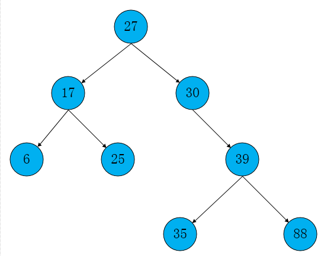  
在进行搜索的时候，从根节点除非，按照大于此节点则遍历到右子树，小于则遍历到左子树。了解好二叉搜索树之后进入相应的B族树。
## B树
B树又称作B-树，是一种多路搜索树，并不是二叉的，B树特征介绍如下:  
>1.定义任意非叶子结点最多只有M个儿子,且M>2,**其中m是表示M阶，是指一个节点最多能拥有的孩子数,M>2**，m=3就是说一个节点最多有3个孩子    
>2.根结点的儿子数为[2, M]   
>3.除根结点以外的非叶子结点的儿子数为[M/2, M]    
>4.每个结点存放至少M/2-1（取上整）和至多M-1个关键字；（至少2个关键字）    
>5.非叶子结点的关键字个数=指向儿子的指针个数-1    
>6.非叶子结点的关键字：K[1], K[2], …, K[M-1]；且K[i] < K[i+1]  
>7.非叶子结点的指针：P[1],P[2]…P[M],其中P[1]指向关键字小于K[1]的子树，P[M]指向关键字大于K[M-1]的子树，其它P[i]指向关键字属于(K[i-1], K[i])的子树
>8.所有叶子结点位于同一层

示例(M=3,3阶)：  
  
### B树特性
>1.关键字集合分布在整颗树中  
>2.任何一个关键字出现且只出现在一个结点中  
>3.搜索有可能在非叶子结点结束  
>4.其搜索性能等价于在关键字全集内做一次二分查找  
>5.自动层次控制
### B树搜索方式
>B树的搜索，从根结点开始，对结点内的关键字，关键字按照从小到大排序，然后对关键字序列使用二分查找，如果查找到则结束，否则进入查询关键字所属范围的儿子结点，然后递归上面方式，直到所对应的儿子指针为空，或已经是叶子结点。
### B树插入
B树的插入分两部分完成，如下：
>1.首先根据查找算法找到关键字要插入的位置，若找到存在关键字则返回结束，否则查找操作最终肯定落位在某个叶子上。    
>2.判断该结点是否有空位置，即判断该结点的关键字总数是否满足小于m-1（根据特征点4）,如果满足，则说明该结点上还有空位，直接插入即可，不满足说明该结点没有空位置，就需要把该结点分裂成两个。  
>3.**分裂方法**：生产一个新结点，把原结点上的关键字和K从小到大排序后，从中间位置把关键字（不包括中间位置的关键字）分成两部分，左部分所含关键字放在旧结点中，右部分所含关键字放在新结点中，中间位置的关键字连同新结点的存储位置插入到父结点中。如果父结点的关键字个数也超过（m-1），则要再分裂，再往上插。直至这个过程传到根结点为止。

了解了B树的插入，来看一下例子，加深理解   
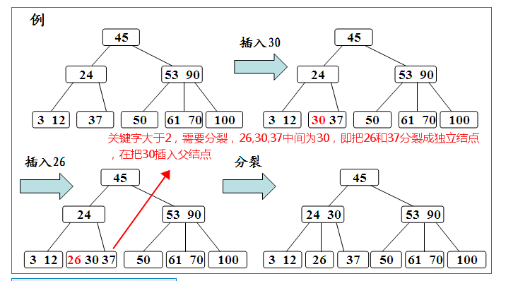 
### B树删除
B树删除关键字K也是分成两部分完成：
>1.同样利用算法找到关键字所在结点，然后根据关键字所在结点是否为叶子结点  
>2.非叶子结点，则删除方式是，确定北山关键字是该结点中的第几个关键字（从1开始），然后确定好后（假设关键字是第1个），根据关键字位置定位到儿子节点所在子树（就是son[1],son从0开始），然后在这个子树中找到最小关键字（肯定是在叶子节点上）,让这个关键字代替被删除的k关键字即可，同时删掉这个最小关键字  
>3.如果是叶子结点，有三种情况：  
>&emsp;&emsp;3.1、如果被删除的关键字所在叶子结点原关键字个数大于等于m/2（取上整），则直接删掉即可  
>&emsp;&emsp;3.2、如果被删除的关键字所在叶子结点远关键字个数等于m/2-1（取上整）,则说明删除后不满足B树性质，及需要调整，调整如下  
>&emsp;&emsp;&emsp;&emsp;3.2.1、如果其左右兄弟结点中有多余关键字,即与该结点相邻的右（左）兄弟结点中的关键字数目大于(m/2)-1（取上整）。则可将右（左）兄弟结点中最小（大）关键字上移至双亲结点。而将双亲结点中小（大）于该上移关键字的关键字下移至被删关键字所在结点中。  
>&emsp;&emsp;&emsp;&emsp;3.2.2、如果左右兄弟结点中没有“多余”的关键字，即与该结点相邻的右（左）兄弟结点中的关键字数目均等于(m/2)-1（取上整）。这种情况比较复杂。需把要删除关键字的结点与其左（或右）兄弟结点以及双亲结点中分割二者的关键字合并成一个结点,即在删除关键字后，该结点中剩余的关键字加指针，加上双亲结点中的关键字Ki一起，合并到Ai（是双亲结点指向该删除关键字结点的左（右）兄弟结点的指针）所指的兄弟结点中去。如果因此使双亲结点中关键字个数小于(m/2)-1(取上整)，则对此双亲结点做同样处理。以致于可能直到对根结点做这样的处理而使整个树减少一层。

看了那么多情况，来看下每个情况的例子：  
①根据第2点删除：    
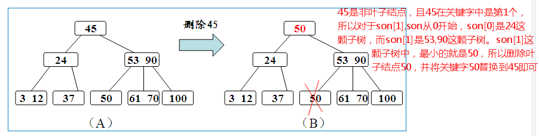  
②根据第3.1点删除：  
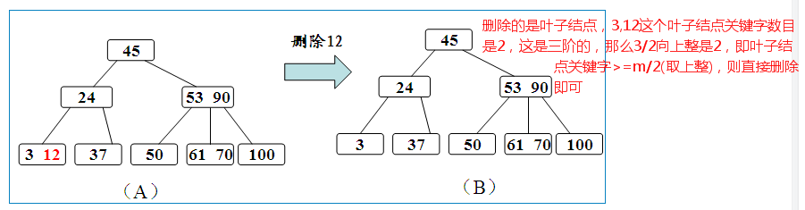  
③根据第3.2.1点删除：  
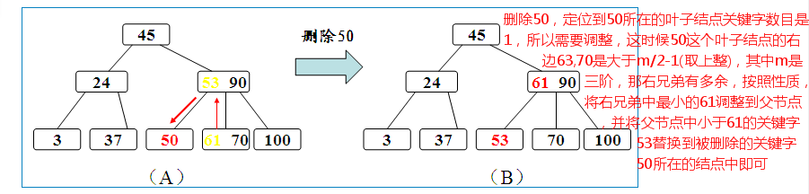  
④根据第3.2.2点删除：  
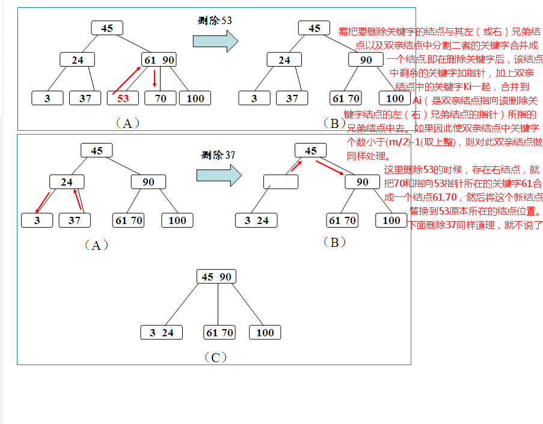  

## B+树
B+树是B树的变体，也是一种多路搜索树，其性质定义与B树基本相同，除了一下几点：
>1.非叶子结点的子树指针与关键字个数相同  
>2.非叶子结点的子树指针P[i]，指向关键字属于[K[i],K[i+1]）的子树，B树是开区间  
>3.为所以叶子结点增加一个链指针  
>4.所有关键字都在叶子结点，而不会出现在非叶子结点
>5.所有叶子节点都在同一层，且关键字数目范围是[[m/2],m]，其中[m/2]表示取大于m/2的最小整数。

示例(M=3,3阶)：  
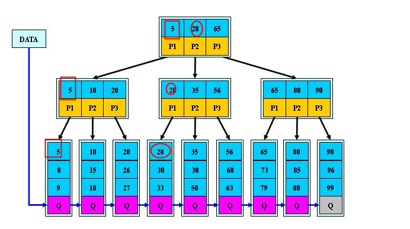  

### B+树特性
>1.所有关键字都出现在叶子结点的链表中，且链表的关键字是有序的  
>2.不可能在非叶子结点命中  
>3.非叶子结点相当于叶子结点的索引，而叶子结点是存储关键字，即数据的数据层  
>4.更适合文件索引系统  

### B+树搜索方式
B+树的搜索方式和B树相同，区别只是B+树只有达到的叶子结点才会命中，在非叶子结点的命中只是索引到其子树。统一在结点内和B树一样采用二分查找

### B+树插入
>1.首先查找要插入其中结点的位置，接着把值插入到结点中  
>2.如果没有结点违规状态则结束  
>3.如果某个结点有过多元素（**关键字数目范围是[[m/2],m]，其中[m/2]表示取大于m/2的最小整数。比如3阶的时候，叶子结点关键字数目在[2,3]**），则把它分裂成两个结点，每个都有最小数目的元素。在树上递归向上继续这个处理直到到达根节点，如果根节点被分裂，则创建一个新根节点。为了使它工作，元素的最小和最大数目典型的必须选择为使最小数不小于最大数的一半。

接下来看3个例子就能知道碰到插入应该如何操作了
例子1：  
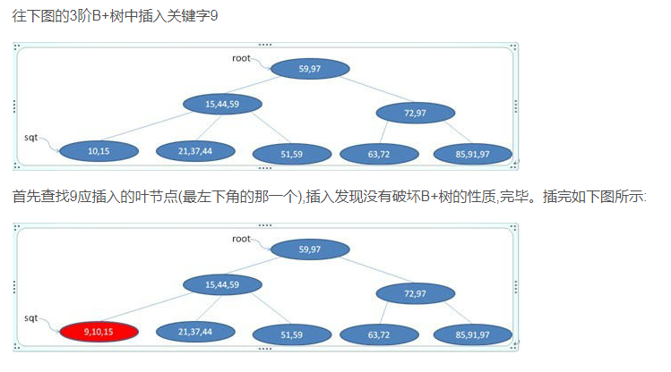  

例子2：  
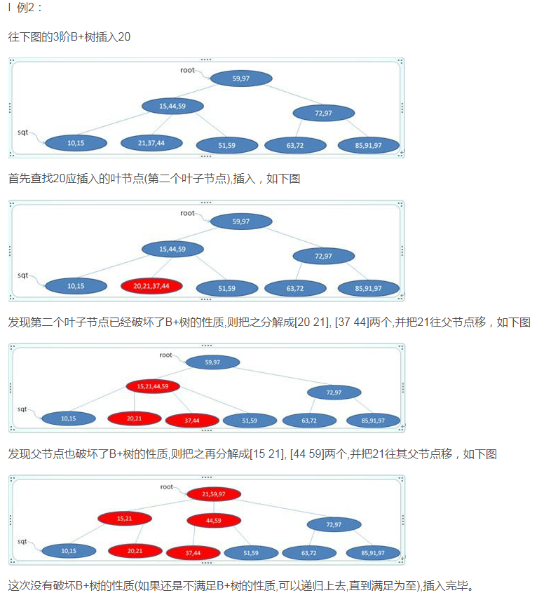  

例子3：  
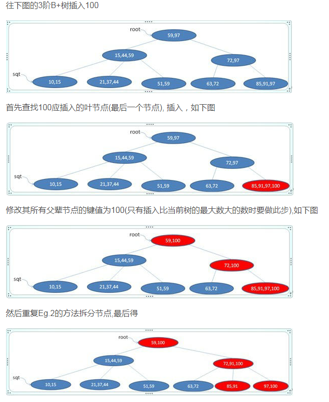  

### B+树删除
>1.首同样是查找要删除的值，在该叶子结点中删除后没有处于违规状态则结束  
>2.如果处于违规，则有两种可能：  
>&emsp;&emsp;2.1、他的兄弟结点，即同一个父结点的子结点，可以把一个或多个它的子节点转移到当前节点，而把它返回为合法状态。如果是这样，在更改父节点和两个兄弟节点的分离值之后处理结束。  
>&emsp;&emsp;2.2、它的兄弟节点由于处在低边界上而没有额外的子节点。在这种情况下把两个兄弟节点合并到一个单一的节点中，而且我们递归到父节点上，因为它被删除了一个子节点。持续这个处理直到当前节点是合法状态或者到达根节点，在其上根节点的子节点被合并而且合并后的节点成为新的根节点。

接下来看5个例子
例子1：    
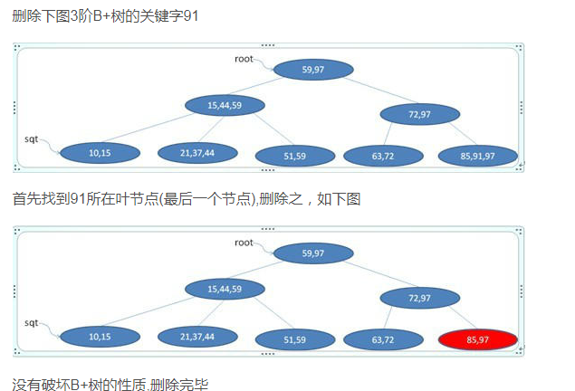  

例子2：  
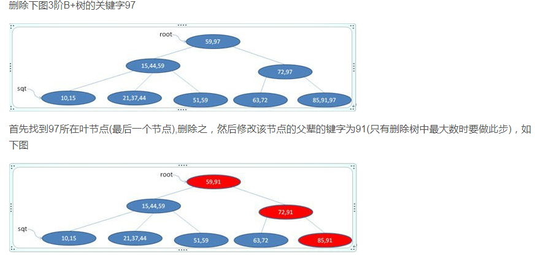 

例子3：  
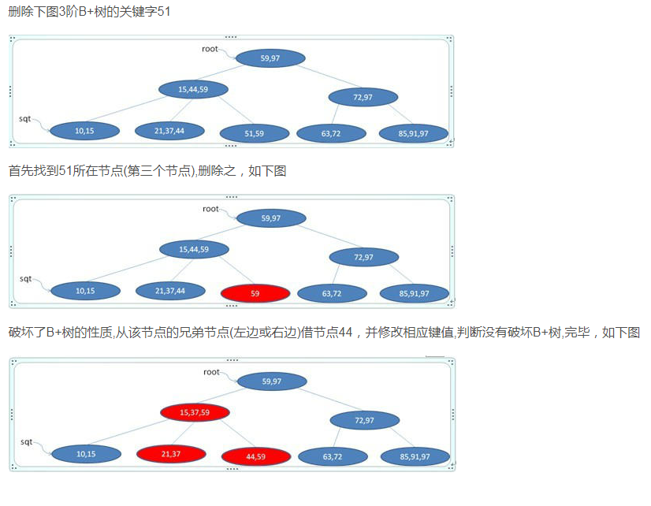 

例子4：    
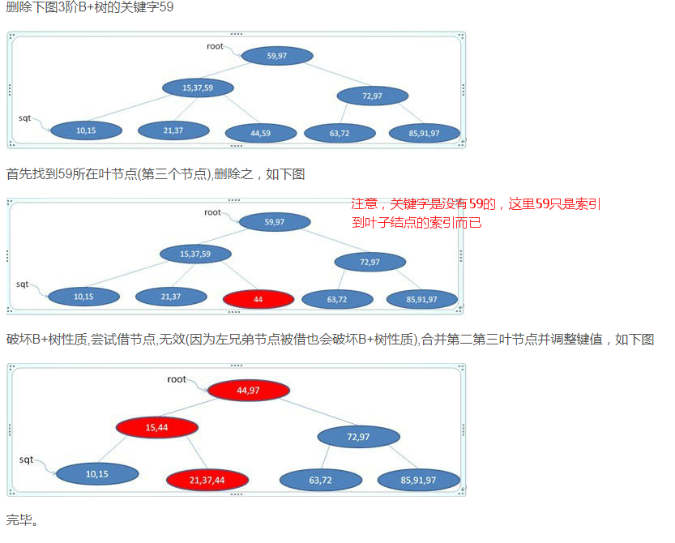 

例子5： 
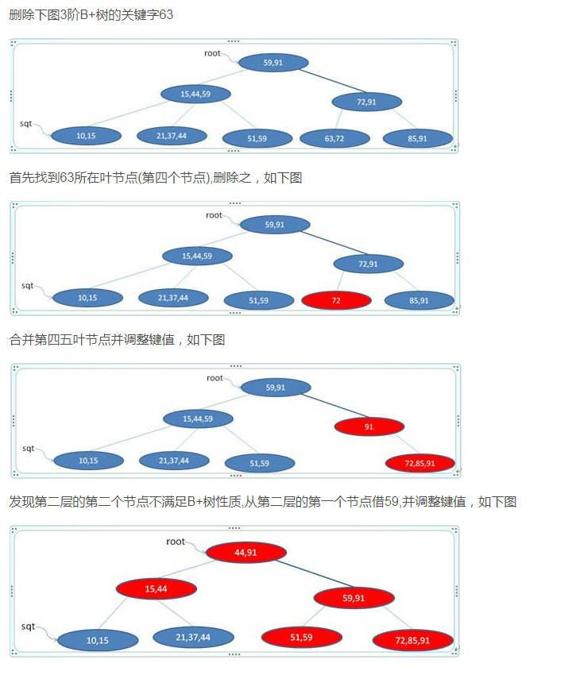 

## B*树
是B+树的变体，在B+树的非根和非叶子结点再增加指向兄弟的指针，如下图所示(M=3,3阶)：  
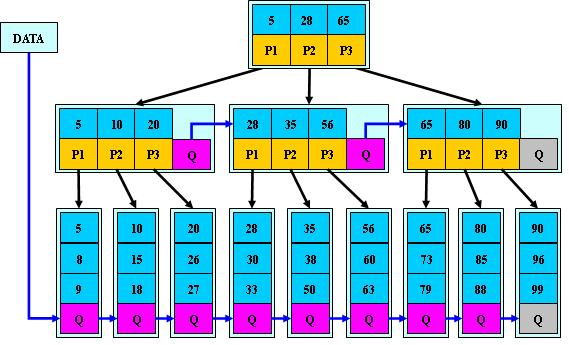  

**B\*树定义了非叶子结点关键字个数至少为(2/3)\*M，即块的最低使用率为2/3,将结点的最低利用率从1/2提高到2/3**

### B*树和B+树区别
>B+树的分裂：当一个结点满时，分配一个新的结点，并将原结点中1/2的数据复制到新结点，最后在父结点中增加新结点的指针；B+树的分裂只影响原结点和父结点，而不会影响兄弟结点，所以它不需要指向兄弟的指针。  

>B*树的分裂：当一个结点满时，如果它的下一个兄弟结点未满，那么将一部分数据移到兄弟结点中，再在原结点插入关键字，最后修改父结点中兄弟结点的关键字（因为兄弟结点的关键字范围改变了）；如果兄弟也满了，则在原结点与兄弟结点之间增加新结点，并各复制1/3的数据到新结点，最后在父结点增加新结点的指针。

所以，B\*树分配新结点的概率比B+树要低，空间使用率更高；更具体的B\*可以自行了解。

## 关于Mysql采用B+树原因
关于Mysql采用B+树的具体原因可参砍参考博文3和4，这里简述说下
>1.B+只有叶子结点存放数据，其余非叶子结点用了索引使用，而B树每个索引都有Data域，因为B+树的内部节点只是作为索引使用，而不像B-树那样每个节点都需要存储硬盘指针，B+树空间利用率更高，可减少I/O次数。  
>2.增删文件（节点）时，效率更高，B+树的叶子节点包含所有关键字，并以有序的链表结构存储，这样可很好提高增删效率。  
>3.B+树的查询效率更加稳定，因为B+树的每次查询过程中，都需要遍历从根节点到叶子节点的某条路径。所有关键字的查询路径长度相同，导致每一次查询的效率相当。（**因为B+树的叶子结点是在同一层**）  

## 总结
>二叉树，每个结点只存储一个关键字，等于则命中，小于走左结点，大于走右结点  
>B-树：多路搜索树，每个结点存储M/2-1到M-1个关键字，非叶子结点存储指向关键字范围的子结点；所有关键字在整颗树中出现，且只出现一次，非叶子结点可以命中  
>B+树：在B-树基础上，为叶子结点增加链表指针，所有关键字都在叶子结点中出现，非叶子结点作为叶子结点的索引；B+树总是到叶子结点才命中  
>B*树：在B+树基础上，为非叶子结点也增加链表指针，将结点的最低利用率从1/2提高到2/3；

## 参考博文：  
>1.https://blog.csdn.net/ls5718/article/details/51745131  
>2.https://blog.csdn.net/zangyuanan320/article/details/52083430  
>3.https://blog.csdn.net/cangchen/article/details/44818485  
>4.https://www.cnblogs.com/xiaoxi/p/6868087.html
