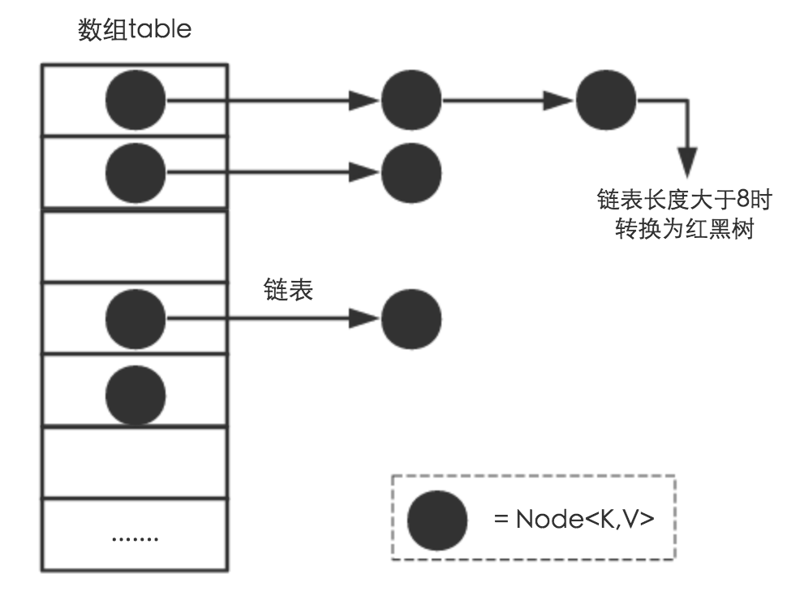

# HashMap源码分析

## HashMap原理简述
&emsp;&emsp;底层数据结构是一个数组，而数组的每一个元素都是链表结构。添加一个key-value元素的时候，先计算元素key的hash值，定位到对应数组的位置，然后对改元素中的链表进行遍历是否存在相同key，存在在覆盖value值，不存在则插入，当链表长度太长的时候，链表会转成红黑树，提高查找效率。

## HashMap结构图

注意，这里长度大于8转为红黑树其实不太准确，网上很多也会这么说，具体下面代码分析会解释一下

## HashMap重要属性
### 1.位桶数组
```java 
transient Node<K,V>[] table;//这个就是上面结构图中的数组了
```
### 2.数组元素Node结构
```java 
static class Node<K,V> implements Map.Entry<K,V> {
	final int hash;
	final K key;
	V value;
	Node<K,V> next;
	......
}//hashmap主要存放的节点，通过next指向下一个节点来构成链表
```
### 3.红黑树
```java 
static final class TreeNode<K,V> extends LinkedHashMap.Entry<K,V> {
	TreeNode<K,V> parent; 
	TreeNode<K,V> left;
	TreeNode<K,V> right;
	TreeNode<K,V> prev;    //删除后需要取消链接,指向前一个节点（原链表中的前一个节点）
	boolean red;
		......
}
```
### 4.其他属性
```java
	 /**
     * 默认的初始化容大小为16，必须是2的n次方，
     */
    static final int DEFAULT_INITIAL_CAPACITY = 1 << 4; // aka 16

    /**
     * 最大容量为2的30次方法
     */
    static final int MAXIMUM_CAPACITY = 1 << 30;

    /**
     * 默认的扩容因子，又称作加载因子
     */
    static final float DEFAULT_LOAD_FACTOR = 0.75f;

    /**
     * 1.8进行的优化，在hash碰撞后，定位到的table里面链表长度达到8个节点的时候
     * 链表会重构成红黑树，查询时间复杂度将变成O(logN)
     * 注意：链表转换成红黑树除了这个以外，还有个前提，就是下面参数MIN_TREEIFY_CAPACITY
     * 当数组table长度大于这个值才会进行转换成红黑树，否则是扩容
     */
    static final int TREEIFY_THRESHOLD = 8;

    /**
     * 这个是上面的逆向操作，当节点小于6的时候，红黑树将重构成链表
     */
    static final int UNTREEIFY_THRESHOLD = 6;

    /**
     * 当table的值小于MIN_TREEIFY_CAPACITY时，不进行树化，只有大于64且某个链表节点超过8
     */
    static final int MIN_TREEIFY_CAPACITY = 64;
	
	/**
     * 存放具体元素的集
     */
    transient Set<Map.Entry<K,V>> entrySet;

    /**
     * 存放元素的个数，不是数组的长度。
     */
    transient int size;

    /**
     * 计数器，对扩容和更改map结构进行计数
     */
    transient int modCount;

    /**
     * 临界值，当实际值超过这个值得时候会进行扩容，这个值等于容量*扩容因子
     *
     */
    int threshold;

    /**
     * 扩容因子
     */
    final float loadFactor;
```

## HashMap构造方法
&emsp;&emsp;构造方法有几个，这里挑两个重要的介绍下：  
### 构造方法1
```java 
/**
* 初始化容量大小和扩容因子
*/
public HashMap(int initialCapacity, float loadFactor) {
	if (initialCapacity < 0)
	    throw new IllegalArgumentException("Illegal initial capacity: " +
		    initialCapacity);
	//初始化容量大小大于最大容量时，table容量为最大容量
	if (initialCapacity > MAXIMUM_CAPACITY)
	    initialCapacity = MAXIMUM_CAPACITY;
	if (loadFactor <= 0 || Float.isNaN(loadFactor))
	    throw new IllegalArgumentException("Illegal load factor: " +
		    loadFactor);
	this.loadFactor = loadFactor;
	/**
	 * 初始化threshold。按道理，threshold应该是如下写法才对：
	 * this.threshold = tableSizeFor(initialCapacity) * this.loadFactor;
	 * 这样才符合threshold的意思,后面看下去会发现，table成员初始化是在put方法中，而put中会对
	 * 对table进行初始化，并重新定义threshold
	 */
	this.threshold = tableSizeFor(initialCapacity);
}

/**
* 返回大于等于initialCapacity的最小的二次幂数值。假设cap为18，返回结果是32
*/
static final int tableSizeFor(int cap) {
	//n=17
	int n = cap - 1;
	//n是10001，无符号右移以为是1000，然后10001与1000按位与结果是：11001
	n |= n >>> 1;
	//同理，n结果是11111
	n |= n >>> 2;
	//同理，n结果是11111
	n |= n >>> 4;
	//同理，n结果是11111
	n |= n >>> 8;
	//同理，n结果是11111
	n |= n >>> 16;
	//n结果就是31+1 = 32
	return (n < 0) ? 1 : (n >= MAXIMUM_CAPACITY) ? MAXIMUM_CAPACITY : n + 1;
}
```

### 构造方法2
&emsp;&emsp;下面对putVal、resize几个重要方法分析会在之后进行分析。
```java 
public HashMap(Map<? extends K, ? extends V> m) {
	this.loadFactor = DEFAULT_LOAD_FACTOR;
	//将m中的所有元素添加至HashMap中
	putMapEntries(m, false);
}

final void putMapEntries(Map<? extends K, ? extends V> m, boolean evict) {
	int s = m.size();
	if (s > 0) {
	    //判断table是否已经初始化
	    if (table == null) {
		//未初始化，则s大小为实际元素个数。ft相当于初始化table大小
		float ft = ((float)s / loadFactor) + 1.0F;
		//当ft大于最大容量时，ft为最大容量，2的30次方
		int t = ((ft < (float)MAXIMUM_CAPACITY) ?
			(int)ft : MAXIMUM_CAPACITY);
		if (t > threshold)
		    //初始化threshold，作用和HashMap(int initialCapacity, float loadFactor)中
		    //的tableSizeFor一样
		    threshold = tableSizeFor(t);
	    }
	    else if (s > threshold)
		//如果table不为空，s大于阈值，则进行扩容
		resize();
	    for (Map.Entry<? extends K, ? extends V> e : m.entrySet()) {
		K key = e.getKey();
		V value = e.getValue();
		//变量m中的值放入table中
		putVal(hash(key), key, value, false, evict);
	    }
	}
}
```

## HashMap之put分析
&emsp;&emsp;注释中包含了介绍
```java
/**
*  将map中指定key和value进行关联，如果map中已经存在该key的映射，则旧的值将会被替换。
*  返回该key映射的旧值，如果该key的映射不存在的话则返回null。
*/
public V put(K key, V value) {
	return putVal(hash(key), key, value, false, true);
}

/**
* todo 扰动函数
*/
static final int hash(Object key) {
	int h;
	/**
	 * 在1.8之前，对定位到table是通过：
	 *      h & (length - 1);
	 * 1.8则优化成了：
	 *      (n-1)&(h^(h>>>16)) //其中n是table长度来进行定位
	 * 分析下为什么这么优化：
	 * 首先，因为hashCode是int的，即32位，当table长度比较小的时候，
	 * 假设就是默认值16，table长度减一后的二进制为00000000...00001111，
	 * 那么如果采用第一种的话，如果A的hashCode值是X1XX....X1XX0000，B的hashCode值是X0XX....XX0X0000，
	 * 与1111按位与的时候都会定位到table[0]上，就没有达到很分散的作用
	 * 而采用第二种的话，将h右移16位，让高低位按位与，加大了分散的可能性，
	 * 当然，如果是A的HashCode是X1X0XX....XXXX0000XXXX...X1XX0000，B的HashCode是X0X01X....1XXX0000XXXX...X0XX0000
	 * 这样A和B高低位按位异或也还是会定位到table[0]上，只是说，这种分散概率远大于直接使用hashCode，充分利用高位进行参与分散
	 *
	 */
	return (key == null) ? 0 : (h = key.hashCode()) ^ (h >>> 16);
}

 /**
* @param hash key的哈希值
* @param key key
* @param value key将要映射的value
* @param onlyIfAbsent 如果是true的话，将不会改变已存在的值
* @param evict 这个参数如果为true，那么每插入一个新值，就会把链表的第一个元素顶出去，保持链表元素个数不变
**/
final V putVal(int hash, K key, V value, boolean onlyIfAbsent,
	   boolean evict) {
	Node<K,V>[] tab; Node<K,V> p; int n, i;
	//table未初始化或者长度为0的时候进行扩容,resize方法后面介绍
	if ((tab = table) == null || (n = tab.length) == 0)
	    n = (tab = resize()).length;
	//（n-1）& hash 这个很重要，根据这个来定位到对应的table位置
	if ((p = tab[i = (n - 1) & hash]) == null)
	    //如果该位置没有链表，则直接组合成node插入即可
	    tab[i] = newNode(hash, key, value, null);
	else {
	    Node<K,V> e; K k;
	    //检查第一个Node的key是不是和插入的key一样，一样则返回这个node对象
	    if (p.hash == hash &&
		    ((k = p.key) == key || (key != null && key.equals(k))))
		e = p;
	    else if (p instanceof TreeNode)//如果是树节点，则调用相应的putVal方法,此方法在后面介绍
		e = ((TreeNode<K,V>)p).putTreeVal(this, tab, hash, key, value);
	    else { //如果是链表则之间遍历查找
		for (int binCount = 0; ; ++binCount) {
		    //如果下一个节点是null，则直接将插入的key-value组成node，查到p的后面
		    if ((e = p.next) == null) {
			p.next = newNode(hash, key, value, null);
			//如果table的该位置的元素长度大于等于7的话，结构进行树化，在
			//treeifyBin里面会判断 (n = tab.length) < MIN_TREEIFY_CAPACITY
			//如果table长度不大于64,只会做扩容，不会树化
			if (binCount >= TREEIFY_THRESHOLD - 1)
			    treeifyBin(tab, hash);
			break;
		    }
		    //如果有相同的key值就结束遍历
		    if (e.hash == hash &&
			    ((k = e.key) == key || (key != null && key.equals(k))))
			break;
		    p = e;
		}
	    }
	    //链表上有相同的key值,则将值进行替换，并对参数onlyIfAbsent、oldValue参数进行操作，
	    //afterNodeAccess抽象方法，采用了模板方法，子类自定义实现
	    if (e != null) { // existing mapping for key
		V oldValue = e.value;
		if (!onlyIfAbsent || oldValue == null)
		    e.value = value;
		afterNodeAccess(e);
		return oldValue;
	    }
	}
	++modCount;
	//table存放个数超过临界值则扩容
	if (++size > threshold)
	    resize();
	//afterNodeInsertion，采用了模板方法,子类自定义实现
	afterNodeInsertion(evict);
	return null;
}

 /**
* 重点方法之一，扩容
*/
final Node<K,V>[] resize() {
	//保存当前table
	Node<K,V>[] oldTab = table;
	//当前table大小
	int oldCap = (oldTab == null) ? 0 : oldTab.length;
	//当前阈值
	int oldThr = threshold;
	int newCap, newThr = 0;
	//之前table大小大于0的时候
	if (oldCap > 0) {
	    //之前table大于最大容量
	    if (oldCap >= MAXIMUM_CAPACITY) {
		//阈值变成最大值，并直接返回
		threshold = Integer.MAX_VALUE;
		return oldTab;
	    }
	    //容量翻倍，newCap值等于oldCap << 1，
	    // 即原来大小乘以2，如果小于最大容量，
	    // 且原来大小是要大于初始化容量的16时，新阈值等于旧阈值的两倍
	    else if ((newCap = oldCap << 1) < MAXIMUM_CAPACITY &&
		    oldCap >= DEFAULT_INITIAL_CAPACITY)
		newThr = oldThr << 1;
	}
	else if (oldThr > 0) //之前阈值大于0时
	    //容量等于旧阈值
	    newCap = oldThr;
	else {       //当table大小是0，且阈值也是0的时候，默认容量是16，阈值是16*0.75=12
	    newCap = DEFAULT_INITIAL_CAPACITY;
	    newThr = (int)(DEFAULT_LOAD_FACTOR * DEFAULT_INITIAL_CAPACITY);
	}
	if (newThr == 0) { //新阈值是0的时候
	    float ft = (float)newCap * loadFactor;
	    newThr = (newCap < MAXIMUM_CAPACITY && ft < (float)MAXIMUM_CAPACITY ?
		    (int)ft : Integer.MAX_VALUE);
	}
	//这里才是真正阈值定义的地方
	threshold = newThr;
	//下面是初始化扩容的Node的新table
	@SuppressWarnings({"rawtypes","unchecked"})
	Node<K,V>[] newTab = (Node<K,V>[])new Node[newCap];
	table = newTab;
	//如果之前table已经初始化，则做迁移
	if (oldTab != null) {
	    for (int j = 0; j < oldCap; ++j) { //遍历旧table
		Node<K,V> e;
		if ((e = oldTab[j]) != null) {
		    oldTab[j] = null; //清除旧table中j位置,置为null,让gc回收
		    if (e.next == null) //如果table[j]位置的第一个node没有next，直接将这个值的链接付给新table
			newTab[e.hash & (newCap - 1)] = e;//e的hash值和(newCap-1)进行与操作,确定新table中的位置
		    else if (e instanceof TreeNode)
		    //说明原来数组中同个hash位置不止1个node,且node类型是TreeNode类型变量,
		    //则采用红黑树管理冲突的键值对
			((TreeNode<K,V>)e).split(this, newTab, j, oldCap);
		    else {  // 这说明原来数组中同个hash位置不止1个node, 但是Node类型不是TreeNode的话还是采用链表进行处理

			Node<K,V> loHead = null, loTail = null;
			Node<K,V> hiHead = null, hiTail = null;
			Node<K,V> next;
			do {
			    next = e.next;
			    /**
			     *   (e.hash & oldCap) == 	0重点说明下，
			     *   它将原来的链表数据散列到2个下标位置，概率是当前位置50%，高位位置50%。
			     *   它有两种结果，一个是0，一个是oldCap
			     *   比如oldCap=8,hash是3，11，19，27时，(e.hash & oldCap)的结果是0，8，0，8，
			     *   这样3，19组成新的链表，index为3；而11，27组成新的链表，新分配的index为3+8；
			     *   且在1.8中，这样的话，就可以不改变链表的顺序，而1.7里面在旧table复制到新table会让里面的元素倒叙
			     */
			    if ((e.hash & oldCap) == 0) {
				if (loTail == null)
				    loHead = e;
				else
				    loTail.next = e;
				loTail = e;
			    }
			    else {
				if (hiTail == null)
				    hiHead = e;
				else
				    hiTail.next = e;
				hiTail = e;
			    }
			} while ((e = next) != null);
			if (loTail != null) {
			    loTail.next = null;
			    newTab[j] = loHead;
			}
			if (hiTail != null) {
			    hiTail.next = null;
			    newTab[j + oldCap] = hiHead;
			}
		    }
		}
	    }
	}
	return newTab;
}
```
&emsp;&emsp;put方法大致总结：  
	1.首先对key的hashCode做一次散列，高低位进行按位异或，然后将结果和table长度减1进行按位与来确定key在table中的位置
	2.判断key与改位置有没有进行碰撞，没有则直接组成node放入桶中
	3.碰撞了，如果节点对象是树节点，则以树形式添加到桶中（后面分析）
	3.非树形式，则以链表形式挂在桶中
	4.如果链表长度大于等于7，且table长度大于64，则进行树化，否则进行扩容
	5.如果节点e存在，则将旧值替换成新值
	6.最后如果桶中元素大于临界值，即扩容因子*table容量，则要进行扩容（扩容内容参考注释即可）。

## HashMap之get分析
&emsp;&emsp; get方法比较简单，就不重点分析了
```java 
public V get(Object key) {
	Node<K,V> e;
	//hash方法上面已经分析了，如果不存在返回null
	return (e = getNode(hash(key), key)) == null ? null : e.value;
}

/**
* get方法
*/
final Node<K,V> getNode(int hash, Object key) {
	Node<K,V>[] tab; Node<K,V> first, e; int n; K k;
	if ((tab = table) != null && (n = tab.length) > 0 &&
		(first = tab[(n - 1) & hash]) != null) {
	    //判断是否是第一个节点
	    if (first.hash == hash &&
		    ((k = first.key) == key || (key != null && key.equals(k))))
		return first;
	    if ((e = first.next) != null) {
		if (first instanceof TreeNode)//如果是树节点，则用TreeNode的getTreeNode方法来查找相应的key
		    return ((TreeNode<K,V>)first).getTreeNode(hash, key);
		do {//否则遍历链表来查找
		    if (e.hash == hash &&
			    ((k = e.key) == key || (key != null && key.equals(k))))
			return e;
		} while ((e = e.next) != null);
	    }
	}
	return null;
}
```
&emsp;&emsp;get方法总结：
	1.先根据hash来计算获得key在table桶里的位置
	2.如果key等于该位置第一个节点的话，直接返回该节点node
	3.否则如果是树型，则通过getTreeNode方法进行遍历查找树，并返回对应key，时间复杂度为O(logn)
	4.如果是链表则遍历查找，时间复杂度为O(n)
