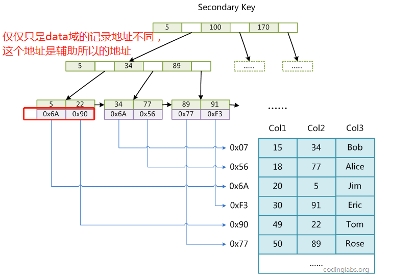
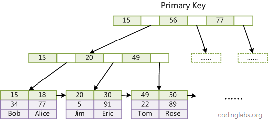
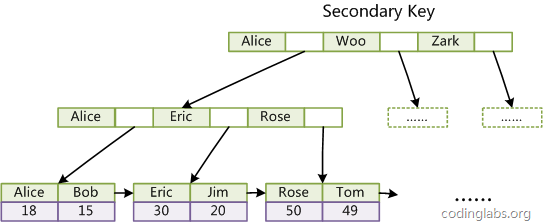
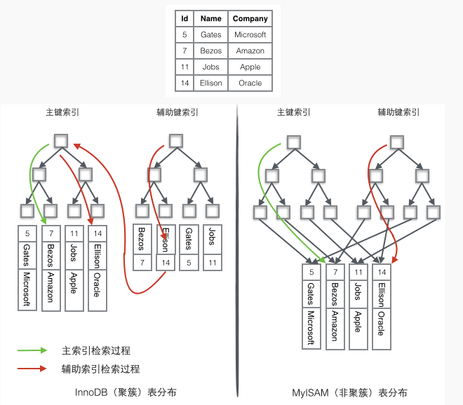

# MySql 索引
## 前言
>本内容主要来简单了解下MySql的MyISAM和InnoDB两个存储引擎下的索引

## 存储引擎
>存储引擎是数据库底层软件组织，数据库管理系统（DBMS）使用数据引擎进行创建、查询、更新和删除数据。不同的存储引擎提供不同的存储机制、索引技巧、锁定水平等功能，使用不同的存储引擎，还可以 获得特定的功能。现在许多不同的数据库管理系统都支持多种不同的数据引擎。MySQL的核心就是存储引擎。

## MyISAM
MyISAM拥有较高的插入、查询速度，但**不支持事物**。MyISAM主要特性有：
>1、每个MyISAM表最大索引数是64，这可以通过重新编译来改变。每个索引最大的列数是16  
>2、最大的键长度是1000字节，这也可以通过编译来改变，对于键长度超过250字节的情况，一个超过1024字节的键将被用上  
>3、BLOB和TEXT列可以被索引  
>4、NULL被允许在索引的列中，这个值占每个键的0~1个字节  
>5、所有数字键值以高字节优先被存储以允许一个更高的索引压缩  
>6、每个MyISAM类型的表都有一个AUTO_INCREMENT的内部列，当INSERT和UPDATE操作的时候该列被更新，同时AUTO_INCREMENT列将被刷新。所以说，MyISAM类型表的AUTO_INCREMENT列更新比InnoDB类型的AUTO_INCREMENT更快

使用MyISAM引擎创建数据库，将产生3个文件。文件的名字以表名字开始，扩展名之处文件类型：frm文件存储表定义、数据文件的扩展名为.MYD（MYData）、索引文件的扩展名时.MYI（MYIndex）

## MyISAM 索引实现
MyISAM引擎使用B+Tree作为索引结构，叶节点的data域存放的是数据记录的地址。下图是MyISAM索引的原理图：  
  
**这里设表一个有三列，其中Col1为主键，上图就是一个MyISAM主索引示意图，可以看出MyISAM索引文件保存的仅仅是数据记录的地址。在MyISAM中，主索引和辅助索引在结构上没有任何区别，只是主索引要求key是唯一的，而辅助索引的key可以重复。如果我们在Col2上建立一个辅助索引，则此索引的结构如下图所示**：    
  
**辅助索引也同样是一个B+Tree，只是data域记录的书辅助索引Col2数据的数据地址。因此，MyISAM中索引检索的算法为首先按照B+Tree搜索算法搜索索引，如果指定的Key存在，则取出其data域的值，然后以data域的值为地址，读取相应数据记录。MyISAM的索引方式也叫做“非聚集”的**  

## InnoDB
InnoDB是事务型数据库的首选引擎，支持事务安全表（ACID），支持行锁定和外键，InnoDB是默认的MySQL引擎。InnoDB主要特性有：
>1、InnoDB给MySQL提供了具有提交、回滚和崩溃恢复能力的事物安全（ACID兼容）存储引擎。InnoDB锁定在行级并且也在SELECT语句中提供一个类似Oracle的非锁定读。这些功能增加了多用户部署和性能。在SQL查询中，可以自由地将InnoDB类型的表和其他MySQL的表类型混合起来，甚至在同一个查询中也可以混合  
>2、InnoDB是为处理巨大数据量的最大性能设计。它的CPU效率可能是任何其他基于磁盘的关系型数据库引擎锁不能匹敌的  
>3、InnoDB支持外键完整性约束，存储表中的数据时，每张表的存储都按主键顺序存放，如果没有显示在表定义时指定主键，InnoDB会为每一行生成一个6字节的ROWID，并以此作为主键  

InnoDB不创建目录，使用InnoDB时，MySQL将在MySQL数据目录下创建一个名为ibdata1的10MB大小的自动扩展数据文件，以及两个名为ib_logfile0和ib_logfile1的5MB大小的日志文件

## InnoDB 索引实现
InnoDB和MyISAM的索引结构差别还是挺大的，主要重大区别是有一下几点。  
**一：InnoDB的数据文件本身就是索引文件,而上面了解的MyISAM索引文件和数据文件是分离的，索引文件仅保存数据记录的地址，而在InnoDB中，表数据文件本身就是按B+Tree组织的一个索引结构，这棵树的叶节点data域保存了完整的数据记录。这个索引的key是数据表的主键，因此InnoDB表数据文件本身就是主索引**。  
  

上图是**InnoDB主索引（同时也是数据文件）**的示意图，很明显可以看到叶节点包含了完整的数据记录。这种索引叫做**聚集索引**，因为InnoDB的数据文件本身要按主键聚集，所以InnoDB要求表必须有主键（MyISAM可以没有），如果没有显式指定，则MySQL系统会自动选择一个可以唯一标识数据记录的列作为主键，如果不存在这种列，则MySQL自动为InnoDB表生成一个隐含字段作为主键，这个**字段长度为6个字节，类型为长整形**。  

**二：与MyISAM索引的不同是InnoDB的辅助索引data域存储相应记录主键的值而不是地址。换句话说，InnoDB的所有辅助索引都引用主键作为data域。例如，定义在Col3上的一个辅助索引**：   
  

上图中Bob、Eric这些要你管管用ASCII码表示更加准确。上面这种InnoDB聚集索引实现方式使得按主键的搜索十分高效，但是**辅助索引搜索需要检索两遍索引：首先检索辅助索引获得主键，然后用主键到主索引中检索获得记录**。  
了解InnoDB索引方式只会就很容易明白为什么不建议使用过长的字段作为主键，因为所有辅助索引都引用主索引，过长的主索引会令辅助索引变得过大。再例如，用非单调的字段作为主键在InnoDB中不是个好主意，因为InnoDB数据文件本身是一颗B+Tree，非单调的主键会造成在插入新记录时数据文件为了维持B+Tree的特性而频繁的分裂调整，十分低效，而使用自增字段作为主键则是一个很好的选择。

*在InnoDB中还有个重要概念是Page，这里就不在扩展这个，自己可以在参考博文第三个自行了解*。

## 总结
最后直接以一个例子作为总结，一个表如下图存储了4行数据。其中Id作为主索引，Name作为辅助索引。图示清晰的显示了聚簇索引和非聚簇索引的差异。  
  

## 参考博文
>1.https://www.cnblogs.com/wcwen1990/p/6655416.html  
>2.http://blog.codinglabs.org/articles/theory-of-mysql-index.html  
>3.http://www.admin10000.com/document/5372.html

