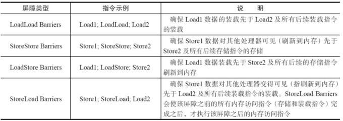
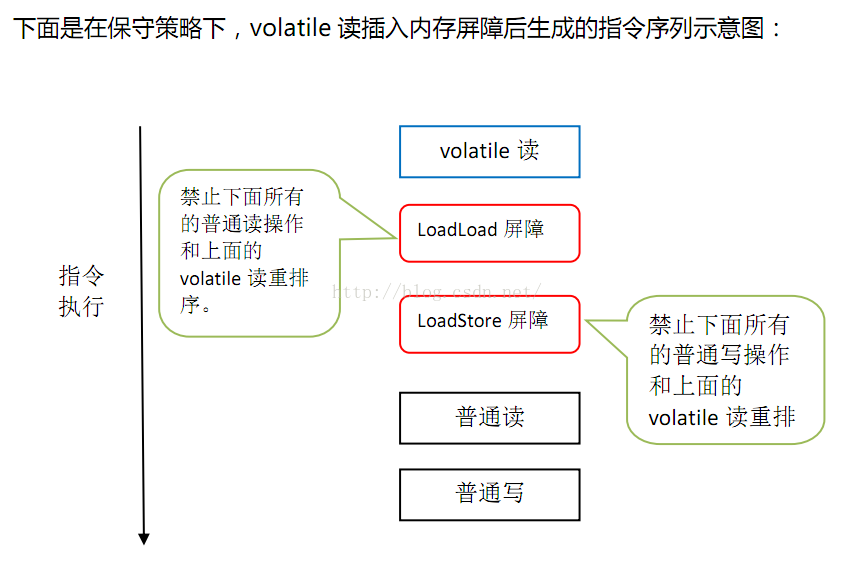

# Volatile
## 前言
>volatile主要作用有两个。一个是volatile可以禁止指令的重排序优化，另一个作用是提供多线程访问共享变量的内存可见性。本文主要从这两个点进行讨论

## JMM结构模型
在理解volatile之前，需要先来了解一些其他知识，这里先了解下JMM的结构模型。由于CPU处理速度和主存的读写速度差距较大，所以每个CPU会有缓存。一般对于一个共享变量，会先存放在主存中，每启动一个线程时，每个线程都有属于自己的工作内存，并会将主存的共享变量拷贝到自己的工作内存，之后读写操作均对于工作内存的变量副本，并在某个时刻会将工作内存中的变量副本写到主存中去，大致流程可如下图所示。  
  

在上面A线程和B线程完成通讯主要经历2步骤。  
>1.线程A从主内存中将共享变量读入线程A的工作内存后并进行操作，之后将数据重新写会主内存中  
>2.线程B从主内存中读取最新的共享变量到自己的工作内存中  
**问题：根据上面步骤，可能会出现问题，当线程A更新工作内存中的变量，但并没及时会写到主内存，此时B线程去读主内存的共享变量，读到的过期的脏数据。这时候，为了避免这种情况的出现，可以通过同步机制或者通过volatile关键字使得每次volatile变量每次变更都会强制刷新到主内存。**

当然上面说的其实**仅仅只是保证了变量的可见性，但不能保证变量的原子性**，下面图更详细展示了一个共享变量进入工作内存，在从工作内存写会主内存  
  
上图主要流程如下步骤：
>1、read and load：从主存复制变量到当前工作内存  
>2、use and assign：执行代码，改变共享变量值   
>3、store and write：用工作内存数据刷新主存相关内容  

其中use and assign 可以多次出现，为什么说volatile修饰不能保证原子性呢，举个例子，假设主存中count值是5，有两个线程1，2都read and load了count执行，这时候，假设线程1在use and assign中对count进行了加1，但还没store and write的时候阻塞了，线程而对count也加1并最后store and write了，那么此时主内存count是6，根据**缓存一致性协议（后文中有讲）**，此时工作内存中变量副本失效，重新读取主内存的count为6，接着线程1不阻塞，会执行store and write，将工作内存中count赋为6并刷新到主内存中。最后结果可能count还是6，而不是7。

## 重排序
有序性是指程序执行的顺序按照代码的先后顺序执行，但为了提高性能，编译器和处理器常常会对指令进行重排序。什么是重排序，重排序就是会对代码进行优化，不保证程序中各个语句的执行先后顺序和代码中的顺序一直，但会保证程序最终执行结果和代码执行结果一致。如下代码
```java 
int i = 0;
boolean flag = false;
i = 1;                //语句1  
flag = true;          //语句2
```
上面代码中语句1和语句2执行对最终程序结果没有影响，所以可能在执行的时候，语句2优先于语句1执行，接着在看一段代码。
```java
int a = 10;    //语句1
int r = 2;    //语句2
a = a + 3;    //语句3
r = a*a;     //语句4
```
上面代码中执行顺序不可能是语句2-语句1-语句4-语句3，因为在**重排序的时候是会考虑数据依赖性**，如果一个指令A（可理解一次执行）必须用到另一个指令B，那么处理器会保证执行B先与指令A执行。
上面是真的单线程的，在多线程中如果存在重排序会不会出现问题呢，来看一段代码
```java
//线程1:
context = loadContext();   //语句1
inited = true;             //语句2
 
//线程2:
while(!inited ){
  sleep()
}
doSomethingwithconfig(context);
```
在上述代码中，语句1和语句2没有数据依赖性，如果发生重排序，假设线程1先执行了语句2，还未执行语句1的时候，线程2在执行while循环时，会跳出循环执行doSomethingwithconfig，但此时context还未被初始化，这就会导致出现问题。  
因此，对于以上的多线程下造成的问题，可以使用同步机制或者使用volatile关键字。下面来了解下volatile如何保证有序性

## volatile保证有序性
对应volatile禁止重排序，保证有序性，主要从两方面将。  
>1、当程序执行到volatile变量的读操作或者写操作时，在其前面的操作的更改肯定全部已经进行，且结果已经对后面的操作可见；在其后面的操作肯定还没有进行；  
>2、在进行指令优化时，不能将在对volatile变量访问的语句放在其后面执行，也不能把volatile变量后面的语句放到其前面执行。 

对于上面两点，来举个例子加强了解，如下： 
```java
//x、y为非volatile变量
//flag为volatile变量

x = 2;        //语句1
y = 0;        //语句2
flag = true;  //语句3
x = 4;         //语句4
y = -1;       //语句5
```
**由于flag变量为volatile变量，那么在进行指令重排序的过程的时候，不会将语句3放到语句1、语句2前面，也不会讲语句3放到语句4、语句5后面。但是要注意语句1和语句2的顺序、语句4和语句5的顺序是不作任何保证的。并且volatile关键字能保证，执行到语句3时，语句1和语句2必定是执行完毕了的，且语句1和语句2的执行结果对语句3、语句4、语句5是可见的。**  
了解了这个，对之前doSomethingwithconfig那块代码就只需要对inited使用volatile就能保证在执行inited=true之前context已经初始化完毕。

## 重排序深入
之前说了为了提高性能，编译器和处理器常常会对指令进行重排序。而一般重排序可以分为如下三种。  
  
>**编译器优化的重排序**。编译器在不改变单线程程序语义的前提下，可以重新安排语句的执行顺序；  
>**指令级并行的重排序**。现代处理器采用了指令级并行技术来将多条指令重叠执行。如果不存在数据依赖性，处理器可以改变语句对应机器指令的执行顺序；  
>**内存系统的重排序**。由于处理器使用缓存和读/写缓冲区，这使得加载和存储操作看上去可能是在乱序执行的。

在上图中，1属于编译器重排序，而2和3统称为处理器重排序。这些重排序会导致线程安全的问题，一个很经典的例子就是DCL问题，这个在以后的文章中会具体去聊。针对编译器重排序，JMM的编译器重排序规则会禁止一些特定类型的编译器重排序；针对处理器重排序，编译器在生成指令序列的时候会通过插入内存屏障指令来禁止某些特殊的处理器重排序。  
这里，我们来看一个很经典的重排序导致线程安全的问题（DCL）
```java
public class Singleton {  
    private static Singleton instance=null;  
    private Singleton(){}  
    public static Singleton getInstance(){  
        if(instance==null){  
            synchronized (Singleton.class) {  
                if(instance==null)  
                    instance=new Singleton();//mark行              
            }             
        }  
        return instance;  
    }  
}  
```
上述代码是一个单例，在重排序的情况下是会造成问题的，对应什么问题可以先自己思考下，在看看下面的分析。其实这里是需要了解以下JVM的一些知识，在初始化对象的时候JVM做了哪些操作。这里主要出现问题是这句代码instance = new Singletion()；针对这段代码，JVM主要做了三件事情。 
>1、分配内存给instance  
>2、调用Singleton的构造函数来初始化成员变量  
>3、将instance对象指向分配的内存空间，执行完这不instance就是非null了

然而，在JVM编译器重会进行指令重排序优化，也就是上面第二步和第三步是没有依赖的，执行顺序可能会是1-2-3，也可能是1-3-2。那么，当执行顺序是1-3-2的时候，3执行完毕，2还未执行之前，另一线程抢占了锁，这时if中，instance是非null了，但里面成员变量还未初始化，线程返回instance后，如果使用了instance的成员变量，就会报错了。因此为了防止这种情况，就需要对instance使用valotile禁止重排序
>  private volatile  static Singleton instance=null;  

## hanppens_before原则
**程序在执行的时候发成重排序，那Java是如何保证程序正常执行的**。这里就有两点需要介绍介绍，重点在于第二点。
>1、**as-if-serial**：Java遵循as-if-serial语义，即单线程执行程序时，即使发生重排序，程序的执行结果不能被改变。 
as-if-serial保证了Java程序在单线程运行的情况下，结果的正常,让我们看起来像是顺序执行的样子。  
>2、**happens_before**：为了使Java程序在各个平台执行正常，Java内存模型中规定了happens-before规则。**happens-before的前后两个操作不会被重排序且后者对前者内存可见**。

对于happens-before,如果A线程的写操作a与B线程的读操作b之间存在happens-before关系，尽管a操作和b操作在不同线程，但是JMM会保证a操作将对b操作可见。具体happens-before规则如下：
>1、**程序顺序规则**：一个线程中的每一个操作，happens-before于该现场中的任意后续操作  
>2、**监视器锁规则**：对一个锁的解锁，happens-before于随后对这个锁的加锁  
>3、**volatile变量规则**：对一个volatile域的写，happens-before于任意后续对这个volatile域的读  
>4、**传递性**：如果A happens-before B，B happens-before C，那么A happens-before C  
>5、**start()规则**：如果线程A执行操作ThreadB.start(),启动线程B,那么线程B中的任意操作happens-before与线程A从ThreadB.join()操作  
>6、**join()规则**：如果线程A执行ThreadB.join()并成功返回，那么线程B中的任意操作happens-before于线程A从ThreadB.join()操作成功返回  
>7、**程序中断规则**：对线程interrupted()方法的调用先行于被终端线程的代码检测到中断时间的发生  
>8、**对象finalize规则**：一个对象的初始化完成（构造函数执行结束）先行于发生它的finalize()方法

## volatile实现原理
之前在DCL问题中分析了instance需要用volatile修饰，那么volatile如何实现呢，在生成汇编的时候，volatile修饰的变量会多出**Lock前缀命令**，**Lock前缀指令实际上相当于一个内存屏障（也成内存栅栏）**，有关内存屏障后面会分析，这里先大致对Lock前缀这个命令了解下，这个命令主要用于两方面：
>1、将当前处理器缓存行的数据写回主内存中  
>2、这个写回内存的操作会使得其他CPU里缓存了改内存地址的数据变得无效（即其他工作内存含有这个变量的副本会变得无效）

具体volatile影响流程如下
>为了提高处理速度，处理器不直接和内存进行通信，而是先将系统内存的数据读到内部缓存（L1，L2或其他）后再进行操作，但操作完不知道何时会写到内存。如果对声明了volatile的变量进行写操作，JVM就会向处理器发送一条Lock前缀的指令，将这个变量所在缓存行的数据写回到系统内存。但是，就算写回到内存，如果其他处理器缓存的值还是旧的，再执行计算操作就会有问题。所以，在多处理器下，为了保证各个处理器的缓存是一致的，就会实现**缓存一致性协议**，每个处理器通过**嗅探**在总线上传播的数据来检查自己缓存的值是不是过期了*，当处理器发现自己缓存行对应的内存地址被修改，就会将当前处理器的缓存行设置成无效状态，当处理器对这个数据进行修改操作的时候，会重新从系统内存中把数据读到处理器缓存里。

结合Lock前缀命令用于的方面和整个volatile流程，可以归纳如下：  
>1、Lock前缀的指令会引起处理器缓存写回内存；  
>2、一个处理器的缓存回写到内存会导致其他处理器的缓存失效；  
>3、当处理器发现本地缓存失效后，就会从内存中重读该变量数据，即可以获取当前最新值。

## happens-before之volatile
在之前happens-before的规则中，有一条是volatile变量规则，**对一个volatile域的写，happens-before于任意后续对这个volatile域的读**。这点我们来看个例子加深了解。
```java
public class VolatileExample {
    private int a = 0;
    private volatile boolean flag = false;
    public void writer(){
        a = 1;          //1
        flag = true;   //2
    }
    public void reader(){
        if(flag){      //3
            int i = a; //4
        }
    }
}
```
假设线程A执行writer方法后，线程B执行reader方法。由于volatile修饰flag所以是知道1是先于2执行，3是优于4执行，然后根据happens-before中volatile规则，volatile修饰的flag写要优于读，因此，2先于3，接着根据happens-before的 传递规则，就知道1是优先于4执行。所以2执行结果对3课间，1执行结果对4可见,说明线程A将flag变更为true后，线程B是能够迅速感知的。如下图所示，其中红色根据happens-before的volatile规则，蓝线是根据传递规则  
  

## Volatile之内存屏障
上面之前介绍了被volatile修饰的变量在生成汇编的时候会多出一个Lock前缀。际上相当于一个内存屏障，这里就详细了解下内存屏障。它主要提供三个功能
>1、它确保指令重排序时不会把其后面的指令排到内存屏障之前的位置，也不会把前面的指令排到内存屏障的后面；即在执行到内存屏障这句指令时，在它前面的操作已经全部完成  
>2、它会强制将对缓存的修改操作立即写入主存  
>3、如果是写操作，它会导致其他CPU中对应的缓存行无效

JMM内存屏障提供了四类，如下图所示  
  
>**StoreStore屏障**：禁止上面的普通写和下面的volatile写重排序  
>**StoreLoad屏障**：防止上面的volatile写与下面可能有的volatile读/写重排序  
>**LoadLoad屏障**：禁止下面所有的普通读操作和上面的volatile读重排序  
>**LoadStore屏障**：禁止下面所有的普通写操作和上面的volatile读重排序  

java编译器会在生成指令时在适当的位置会插入内存屏障指令来禁止特定类型的处理器重排序。为了实现volatile的内存语义，JMM会限制特定类型的编译器和处理器重排序，JMM会针对编译器制定volatile重排序规则表：  
  
"NO"表示禁止重排序。**当第二个操作是volatile写时都禁止重排序。当第一个是volatile读时禁止重排序。当第一个操作是volatile写第二是volatile读时禁止重排序。**

为了实现volatile内存语义时，编译器在生成字节码时，会在指令序列中插入内存屏障来禁止特定类型的处理器重排序。对于编译器来说，发现一个最优布置来最小化插入屏障的总数几乎是不可能的，为此，JMM采取了保守策略：  


1、**在每个volatile写操作的前面插入一个StoreStore屏障**  
2、**在每个volatile写操作的后面插入一个StoreLoad屏障**   
  
StoreStore屏障可以保证在volatile写之前，其前面的所有普通写操作已经对任意处理器可见了。因为StoreStore屏障将保障上面所有的普通写在volatile写之前刷新到主内存  
  
3、**在每个volatile读操作的后面插入一个LoadLoad屏障**  
4、**在每个volatile读操作的后面插入一个LoadStore屏障**  
  
**需要注意的是：volatile写是在前面和后面分别插入内存屏障，而volatile读操作是在后面插入两个内存屏障**  

## 内存屏障整体结构如下图  
 
代码示例：  
```java
class VolatileExample {
    int a = 0;
    volatile boolean flag = false;

    public void writer() {
        a = 1;                   //1
        //StoreStore，a对flag可见
        flag = true;               //2
        //StoreLoad，flag和a对后续可见
    }

    public void reader() {
        if (flag) {      		  //3
		//LoadLoad，flag和a可见         
        //LoadStore，flag和a可见
            int i =  a;           //4
            ……
``` 

## 参考博文
>1.http://www.importnew.com/18126.html  
>2.https://blog.csdn.net/eff666/article/details/67640648  
>3.https://www.cnblogs.com/dolphin0520/p/3920373.html  
>4.https://blog.csdn.net/hqq2023623/article/details/51013468