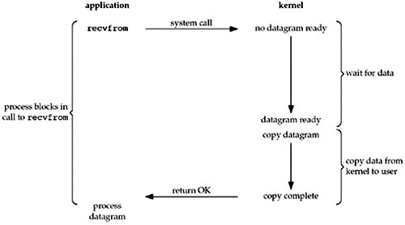
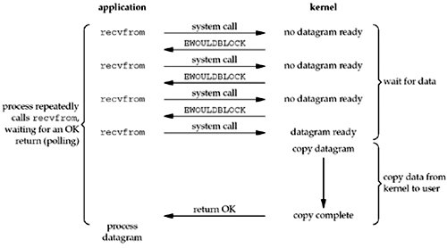
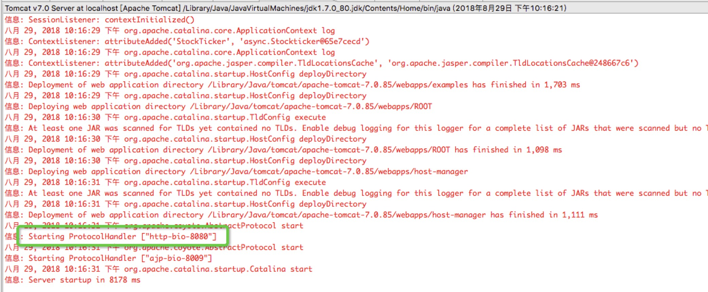

# Tomcat IO

 

## JAVA BIO 
同步并阻塞，服务器实现模式为一个连接一个线程，即客户端有连接请求时服务器端就需要启动一个线程进行处理，如果这个连接不做任何事情会造成不必要的线程开销，当然可以通过线程池机制改善。调用过程如下图：

* 注意：<mark>kernel有2个过程，wait for data和copy data from kernel to user。直到最后copy complete后，recvfrom()才返回。此过程一直是阻塞的。</mark>

## JAVA NIO
同步非阻塞，服务器实现模式为一个请求一个线程，即客户端发送的连接请求都会注册到多路复用器上，多路复用器轮询到连接有I/O请求时才启动一个线程进行处理。调用过程如下图：

## JAVA AIO(NIO2)
异步非阻塞，服务器实现模式为一个有效请求一个线程，客户端的I/O请求都是由OS先完成了再通知服务器应用去启动线程进行处理，与NIO的区别主要是操作系统的底层区别。

***
# 三者对比
IO | 描述  | JDK支持 | 使用场景
---|----- |--------|-----------
Nio | 同步并阻塞 | 默认 | 连接数目比较小且固定
Bio | 同步非阻塞 | jdk1.4 | 连接数目多且连接比较短
Aio | 异步非阻塞 | jdk7   | 连接数目多且连接比较长

# Tomcat配置
> 将tomcat安装目录下conf/server.xml中Connector节点protocol属性值进行修改，默认为Bio/Nio
> 
> * Nio:org.apache.coyote.http11.Http11NioProtocol
> * Aio:org.apache.coyote.http11.Http11Nio2Protocol

> 配置验证

# SpringBoot自带Tomcat调优
> 默认如下

> 新增配置类

***
# 参考资料

[Tomcat IO参考链接](https://blog.csdn.net/hxyerui/article/details/52448387)

[springboot调优参考链接](https://blog.csdn.net/mn960mn/article/details/51306140)
