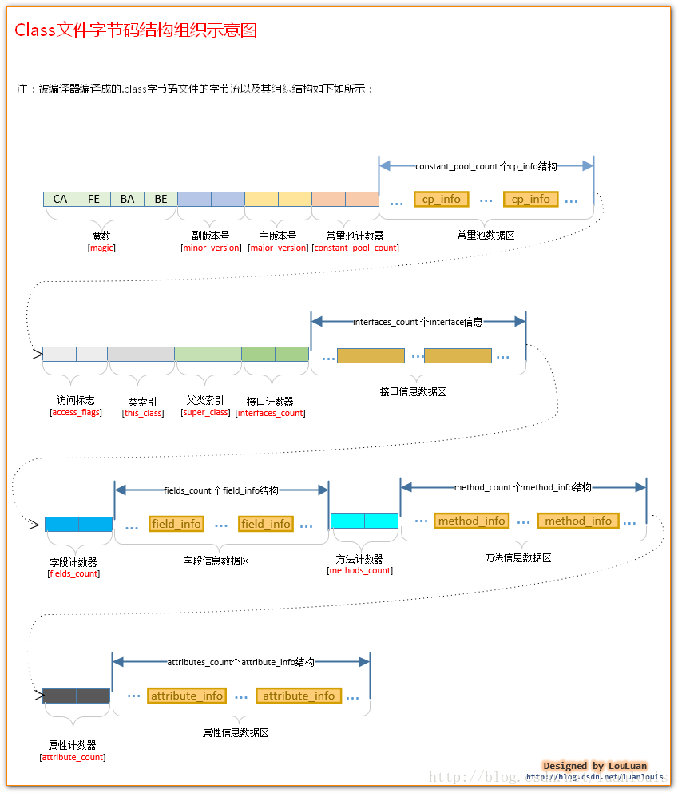
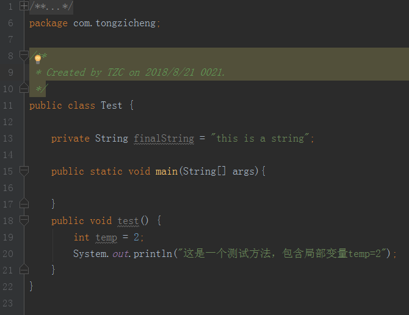
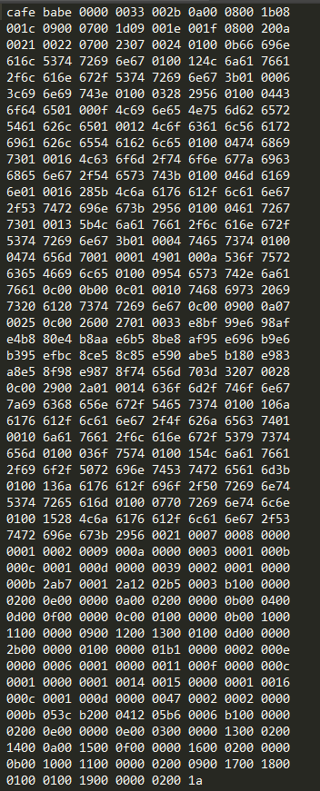
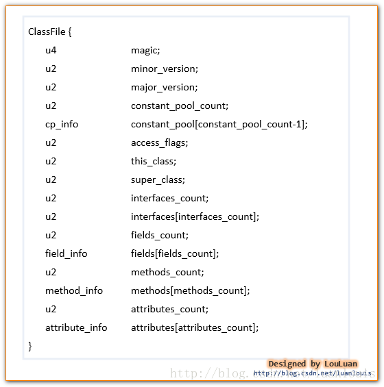

# Class文件结构概述
## Class文件结构简述
&emsp;&emsp;JVM接收的最初数据是class字节码文件，由.java文件编译产生，因此做为一个java程序员，很有必要要了解以下class文件。什么是class文件：class文件是由8位为一组的字节为基本单位，构成的二进制文件。class文件中只有两种类型**无符号数和表。**  
&emsp;&emsp;**无符号数**为基本类型，有：**u1、u2、u4、u8，数字代表字节数**。无符号数可以代表数字、索引引用、数量值，或者按照UTF-8编码构成字符串值  
&emsp;&emsp;**表**则是由基本类型和表构成的类型，属于组合类型  
&emsp;&emsp;具体的class文件结构如下，其中一个框代表1个字节，即u1长度，特殊的如cp_info长度是不定的，看完整个系列就懂了。这个系列就是针对如下图所讲述的，很重要的图（图来自网络）：

了解了class文件结构，下面简述下各个结构含义，具体结构分析会在后面系列，这里简单了解下就可以了，为了更好了解，LZ写了一个普通Test类，并以二进制打开，然后我们把结构图和下面二进制文件结合来理解

### 魔数magic
>所有的由Java编译器编译而成的class文件的前4个字节都是“0xCAFEBABE”它的作用在于：当JVM在尝试加载某个文件到内存中来的时候，会首先判断此class文件有没有JVM认为可以接受的“签名”，即JVM会首先读取文件的前4个字节，判断该4个字节是否是“0xCAFEBABE”，如果是，则JVM会认为可以将此文件当作class文件来加载并使用。通过对魔数来判断文件类型也是比较安全的。  

在Test.class的二进制文件中魔数（长度为u4）:cafbabe
### 版本号（minor_version、major_version)
>主版本号和次版本号在class文件中各占两个字节，副版本号占用第5、6两个字节，而主版本号则占用第7，8两个字节

在Test.class的二进制文件中次版本号(长度u2):0000，主版本号（长度u2）:0033,所以次版本号为0，主版本号为51，对应的是jdk1.7
### 常量池计数器(constant_pool_count)
>常量池是class文件中非常重要的结构，它描述着整个class文件的字面量信息。常量池是由一组constant_pool结构体数组组成的，而数组的大小则由常量池计数器指定。常量池计数器constant_pool_count的值=constant_pool表中的成员数+ 1。constant_pool表的索引值只有在大于0且小于constant_pool_count时才会被认为是有效的。

在Test中constant_pool_count（长度为u2）：002b，所以常量池大小为2*16+11=43
### 常量池数据区(constant_pool[contstant_pool_count-1])
>常量池中有两大类常量类型：字面量和符号引用,具体的看常量池系列，后面讲会讲述。
### 访问标志(access_flags)
>访问标志，access_flags 是一种掩码标志，用于表示某个类或者接口的访问权限及基础属性。

### 类索引(this_class)
>类索引，this_class的值必须是对constant_pool表中项目的一个有效索引值。constant_pool表在这个索引处的项必须为CONSTANT_Class_info 类型常量，表示这个 Class 文件所定义的类或接口。
### 父类索引(super_class)
>父类索引，对于类来说，super_class 的值必须为 0 或者是对constant_pool 表中项目的一个有效索引值。如果它的值不为 0，那 constant_pool 表在这个索引处的项必须为CONSTANT_Class_info 类型常量，表示这个 Class 文件所定义的类的直接父类。当前类的直接父类，以及它所有间接父类的access_flag 中都不能带有ACC_FINAL标记。对于接口来说，它的Class文件的super_class项的值必须是对constant_pool表中项目的一个有效索引值。constant_pool表在这个索引处的项必须为代表 java.lang.Object 的 CONSTANT_Class_info 类型常量 。如果 Class 文件的 super_class的值为 0，那这个Class文件只可能是定义的是java.lang.Object类，只有它是唯一没有父类的类。
### 接口计数器(interfaces_count)
>接口计数器，interfaces_count的值表示当前类或接口的直接父接口数量。
### 接口信息数据区(interfaces[interfaces_count])
>接口表，interfaces[]数组中的每个成员的值必须是一个对constant_pool表中项目的一个有效索引值， 它的长度为 interfaces_count。每个成员 interfaces[i]  必须为 CONSTANT_Class_info类型常量，其中 0 ≤ i <interfaces_count。在interfaces[]数组中，成员所表示的接口顺序和对应的源代码中给定的接口顺序（从左至右）一样，即interfaces[0]对应的是源代码中最左边的接口。
### 字段计数器(fields_count)
>字段计数器，fields_count的值表示当前 Class 文件 fields[]数组的成员个数。 fields[]数组中每一项都是一个field_info结构的数据项，它用于表示该类或接口声明的类字段或者实例字段。
### 字段信息数据区(fields[fields_count])
>字段表，fields[]数组中的每个成员都必须是一个fields_info结构的数据项，用于表示当前类或接口中某个字段的完整描述。 fields[]数组描述当前类或接口声明的所有字段，但不包括从父类或父接口继承的部分。
### 方法计数器(methods_count)
>方法计数器， methods_count的值表示当前Class 文件 methods[]数组的成员个数。Methods[]数组中每一项都是一个 method_info 结构的数据项。
### 方法信息数据区(methods[methods_count])
>方法表，methods[] 数组中的每个成员都必须是一个 method_info 结构的数据项，用于表示当前类或接口中某个方法的完整描述。如果某个method_info 结构的access_flags 项既没有设置 ACC_NATIVE 标志也没有设置ACC_ABSTRACT 标志，那么它所对应的方法体就应当可以被 Java 虚拟机直接从当前类加载，而不需要引用其它类。 method_info结构可以表示类和接口中定义的所有方法，包括实例方法、类方法、实例初始化方法方法和类或接口初始化方法方法 。methods[]数组只描述当前类或接口中声明的方法，不包括从父类或父接口继承的方法。
### 属性计数器(attributes_count)
>属性计数器，attributes_count的值表示当前 Class 文件attributes表的成员个数。attributes表中每一项都是一个attribute_info 结构的数据项。
### 属性信息数据区(attributes[attributes_count])
>属性表，attributes 表的每个项的值必须是attribute_info结构。

## 总结
&emsp;&emsp;通过上述介绍，将class文件结构概述成如下：

