# Class文件之常量池
## 概述
&emsp;&emsp;从之前结构图看，常量池内容跟着主版本号后面，常量池由常量池计数器（u2长度）,和常量池计数器-1个长度的常量池项组成。如下图所示常量池结构： 
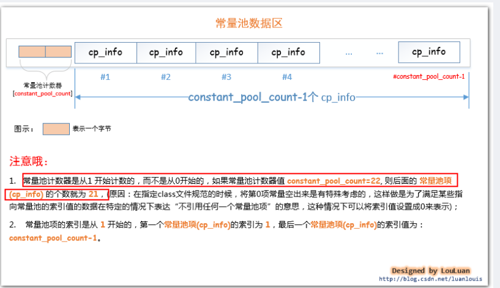  
&emsp;&emsp;因此cp_info是常量池中最重要的结构，下面对这个结构进行分析分析。
## cp_info结构
  
### cp_info中tag对应字面量
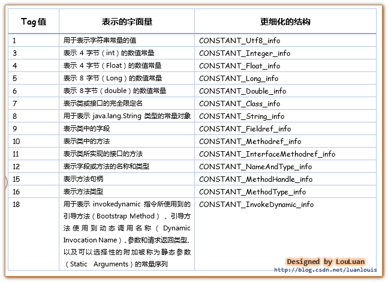  
通过这些字面量可以划分常量池项，如下图  
  
&emsp;&emsp;了解了这些之后，来尝试几种cp_info看看
### cp_info之int、float
	public class IntAndFloatTest {
		
		private final int a = 10;
		private final int b = 10;
		private float c = 11f;
		private float d = 11f;
		private float e = 11f;
		
	}
  
&emsp;&emsp;上面代码定义了5个变量，值就是10和11f两个常量,通过对class文件解析分析，会知道存在两个cp_info，它们的tag分表是3和4，通过查表可以知道对应的字面量结构是：CONSTANT_Integer_info和 Constant_float_info。然后分别对这两个结构查表看以知道他们的结构，如下  
  
&emsp;&emsp;而10就是上面CONSTANT_Integer_info结构tag后面的bytes（长度u4即32位二进制），bytes应该是00 00 00 0a 对应二进制00000000 00000000 00000000 00001010。同理float。而代码中所有用到10的地方都会指向常量池中对应的指针值位置。  
  
### cp_info之long、double
&emsp;&emsp;和上面一样，long对应tag是5，double是6，其常量分别使用CONSTANT_Long_info和Constant_Double_info表示，结构如下  
  
例如下面代码，结构如图介绍

	public class LongAndDoubleTest {
		private long a = -6076574518398440533L;
		private long b = -6076574518398440533L;
		private long c = -6076574518398440533L;
		private double d = 10.1234567890D;
		private double e = 10.1234567890D;
		private double f = 10.1234567890D;
	}
  
  
### cp_info之String
&emsp;&emsp;同样的通过tage=8查表得到string类型的结构如下图  
  
&emsp;&emsp;那么CONSTANT_Utf8_info结构体如下  
  
&emsp;&emsp;代码例子：	

	public class StringTest {
		private String s1 = "JVM原理";
		private String s2 = "JVM原理";
		private String s3 = "JVM原理";
		private String s4 = "JVM原理";
	}
  
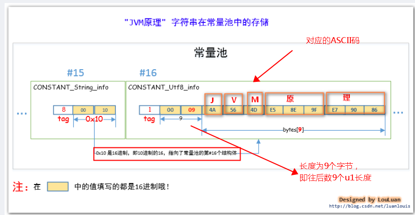  
### cp_info之类文件中定义的类名和类中使用到的类
&emsp;&emsp;tag=7对应的结构是CONSTANT_Class_info，如下  
  
&emsp;&emsp;例子：

	package com.jvm;
	import  java.util.Date;
	public class ClassTest {
		private Date date =new Date();
	}
&emsp;&emsp;对class文件分析后，这个有三个CONSTANT_Class_info结构，我们分析其中一个，分析如下图  
  
### cp_info之属性field字段
先来段代码示例：
	
	public class Person {
		private String name;
		private int age;
		
		public String getName() {
			return name;
		}
		
		public void setName(String name) {
			this.name = name;
		}
		public int getAge() {
			return age;
		}
		
		public void setAge(int age) {
			this.age = age;
		}
	}
&emsp;&emsp;在Person类中，多次使用了age和name字段，而JVM会将name和age当做符号，然后将name和age以field形式保存到常量池中。从class文件中可以得到tag=9,对应的结构是CONSTANT_Fieldref_info ，如下图  
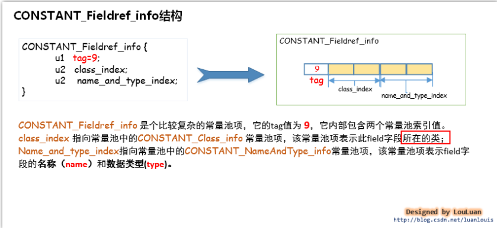  
&emsp;&emsp;其中class_index执行的CONSTANT_CLASS_info上面介绍了就不说了，对于CONSTANT_NameAndType_info结构和说明如下  
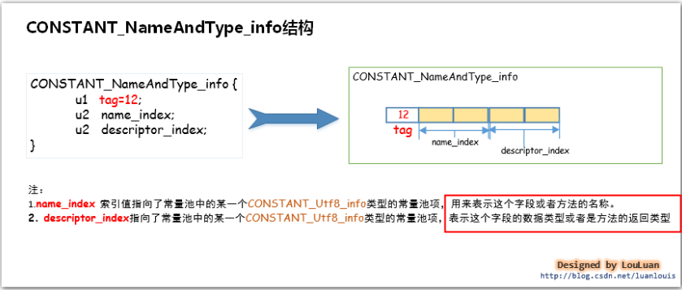  
&emsp;&emsp;因此，一个CONSTANT_Fieldref_info常量项=CONSTANT_CLASS_info  + CONSTANT_NameAndType_info如下图  
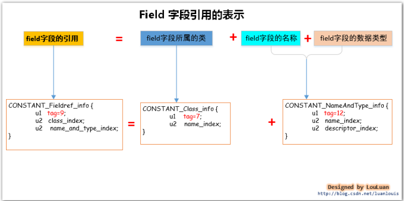  
&emsp;&emsp;更具体的流程如下图和说明  
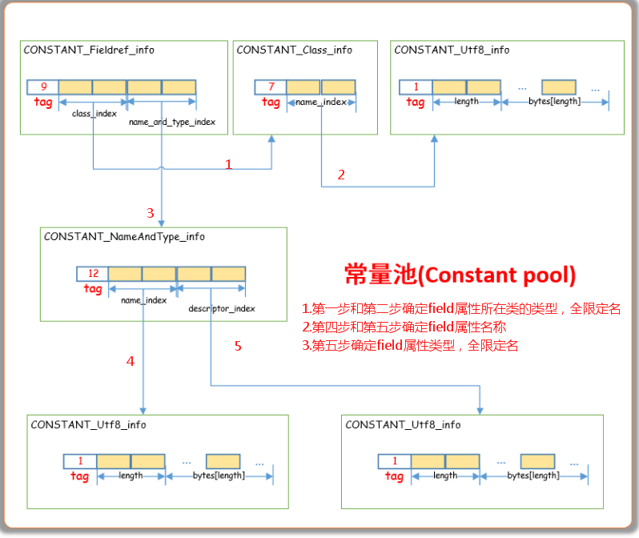  
&emsp;&emsp;这样，现在对上面Person对象中的name这个field属性进行分析，如下图所示  
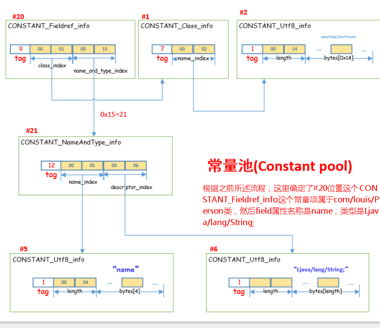  
&emsp;&emsp;上面发现，在CONSTANT_NameAndType_info常量项中的descriptor_index对应CONSTANT_Utf8_info常量项结果是Ljava/lang/String，和我们java代码中表示的java.lang.String 是不太一样。针对field的常量项中field类型和java的类型对应关系如下图  
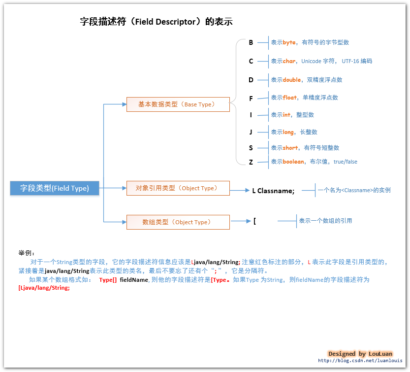  
### cp_info之方法名和方法参数
&emsp;&emsp;还是以上面field模块中Person做例子，但要注意，如果定义的方法或字段等没用被引用的话，编译成class结构后是不会加载到常量池中的，所以在Person中加入下面方法:

	public String getInfo()
	{
		return getName()+"\t"+getAge();
	}
&emsp;&emsp;通过对class文件分析，就能知道getName和getAge会封装成CONSTANT_Methodref_info结构保存到常量池中，CONSTANT_Methodref_info对应的tag是10，结构组成如下：  
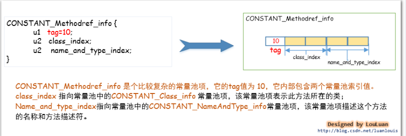  
&emsp;&emsp;因此CONSTANT_Methodref_info = CONSTANT_CLASS_info + CONSTANT_NameAndType_info是不是和上面field很相似啊。因此更具体的结构也是类似  
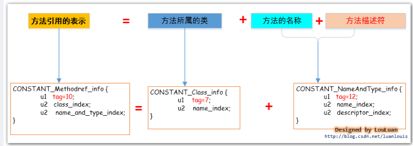  
  
&emsp;&emsp;当然，虽然和field类型相似，但是对比一下class结构中相应二进制，会发现，CONSTANT_CLASS_info是一样的，都是指向当前field或当前方法所在的类，即Person类，而CONSTANT_NameAndType_info中name_index在field中代表属性名称，在方法中代表的是方法名称，而descriptor_index在field中表示field的类型，如Ljava.lang.String，而方法代表的是方法描述符。重点区别就是在于bytes[length]的内容了。那么什么是方法描述符，看看下图就明白了（其中FieldType结构就是上面字段描述符那图的结构）  
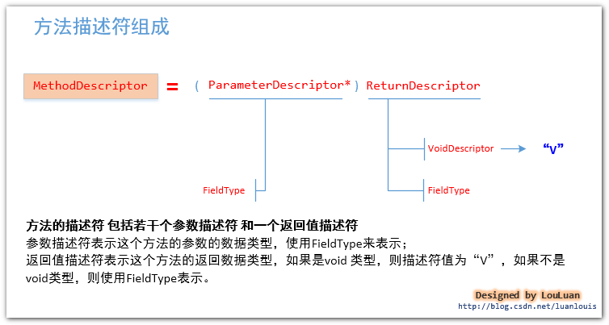  
&emsp;&emsp;了解了这些之后，我们就来看看Person中getName方法在常量池中常量项的表示方法，表示如下图：  
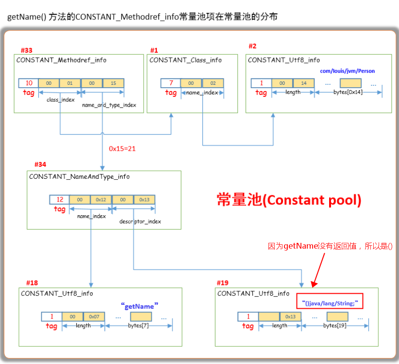  
### cp_info之实现接口中的方法
&emsp;&emsp;具体例子这些就举了，和上面类似，直接看结构，接口中方法在常量池的常量项表示为CONSTANT_InterfaceMethodref_info，如下图  
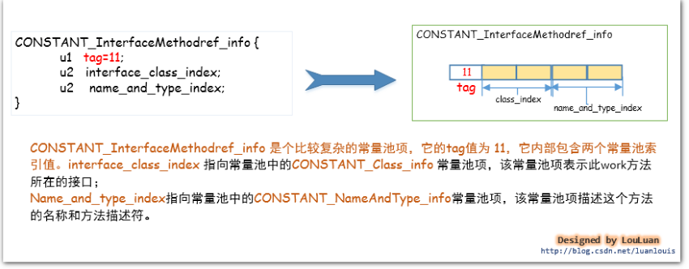  
&emsp;&emsp;其实观察也知道和普通类中的方法类似，只是interface_class_index指向的CONSTANT_CLASS_info表示的是接口的全限定名称，而普通类方法中class_index指向的CONSTANT_CLASS_info表示的是该方法所在类的全限定名称  
## 结尾
&emsp;&emsp;通过对上述各种cp_info类型做了介绍，也就大致理解了常量池，具体的可以尝试自己写一个例子，然后转成二进制，然后对照各种常量项结构来自己进行编译，这样会加深理解，虽然也有很多命令（例如javap –c HelloWorld 、javap –verbose HelloWorld）能帮助我们直接将二进制编译成可读内容，但是对于我们初学者还是多动手，到后期在利用命令去编译，最后，再次附上常量项结构  

