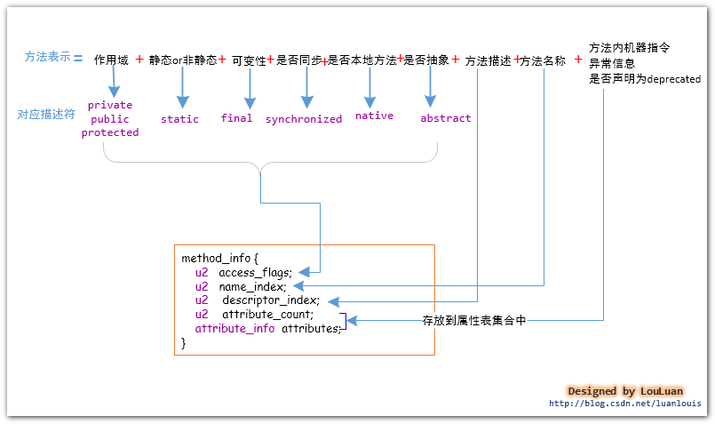
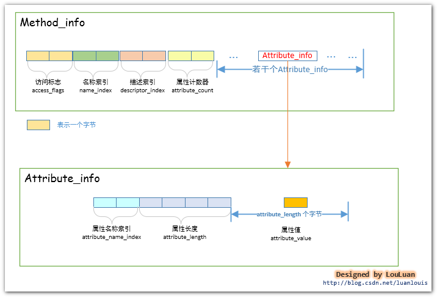

# 方法表集合
## 前言
>&emsp;&emsp;方法表集合是由若干个方法表组成的集合。经过JVM编译成class文件后，会将相应的method方法信息组织到一个叫做方法表集合的结构中，如下图所示：  

  

## method_info
&emsp;&emsp;直接来看看method_info结构体
  
  
&emsp;&emsp;同样的，method_info和field_info结构很类似，这里还是通过访问标志、名称索引和描述索引、方法属性表来分析。  

### 访问标志（access_flags）
&emsp;&emsp; 访问标志（access_flags）主要记录这这个方法的作用域、静态or非静态、可变性、是否可同步、是否本地方法、是否抽象等信息。和之前的访问标志流程一样，方法的访问标志位索引如下  
  
  
&emsp;&emsp;例子这里先不说了，文章最后会有整个例子分析

### 名称索引和描述索引
&emsp;&emsp;同理，这里的名称索引也是指向常量池中的某个常量项，表示方法的名称，而描述索引同样指向常量池中的摸个常量项，来表示方法的返回值和参数，如何表示呢？其实和之前常量池中的
CONSTANT_Methodref_info结构指向的CONSTANT_NameAndType_info结构中的descriptor_index一样，如下图  
  

### 属性表集合
&emsp;&emsp;属性表集合是方法表集合中比较重要的部分，对应属性表集合来说，它主要记录方法的信息，这些信息如下：  
>1. 这个方法的代码实现，即方法的可执行的机器指令  
>2. 这个方法声明的要抛出的异常信息  
>3. 这个方法是否被@deprecated注解表示  
>4. 这个方法是否是编译器自动生成的  
>
&emsp;&emsp;属性表集合中属性计数器就不说了，直接来看下的那个属表（Attribute_info）结构  
  
&emsp;&emsp;其中attributr_info有很多类型的属性表，这里介绍比较重要的code类型和Exceptions类型，对于其他类型可自行了解，下面附上部分类型，更多可参看《深入理解Java虚拟机》  
  
&emsp;&emsp;code类型的属性表包含的是JVM可以运行的机器码指令，JVM能够运行这个类，就是从这个属性中取出机器码的。那么来看看code属性表信息，如下图  
  
  
>机器指令----code：

&emsp;&emsp;目前的JVM使用一个字节表示机器操作码，即对JVM底层而言，它能表示的机器操作码不多于2的 8 次方，即 256个。class文件中的机器指令部分是class文件中最重要的部分，并且非常复杂，这里不主要介绍，可以自行了解  

>异常处理跳转信息---exception_table：

&emsp;&emsp;如果代码中出现了try{}catch{}块，那么try{}块内的机器指令的地址范围记录下来，并且记录对应的catch{}块中的起始机器指令地址，当运行时在try块中有异常抛出的话，JVM会将catch{}块对应懂得其实机器指令地址传递给PC寄存器，从而实现指令跳转；

>Java源码行号和机器指令的对应关系---LineNumberTable属性表：

&emsp;&emsp;编译器在将java源码编译成class文件时，会将源码中的语句行号跟编译好的机器指令关联起来，这样的class文件加载到内存中并运行时，如果抛出异常，JVM可以根据这个对应关系，抛出异常信息，告诉我们我们的源码的多少行有问题，方便我们定位问题。这个信息不是运行时必不可少的信息，但是默认情况下，编译器会生成这一项信息，如果你项取消这一信息，你可以使用-g:none 或-g:lines来取消或者要求设置这一项信息。如果使用了-g:none来生成class文件，class文件中将不会有LineNumberTable属性表，造成的影响就是 将来如果代码报错，将无法定位错误信息报错的行，并且如果项调试代码，将不能在此类中打断点（因为没有指定行号。）

>局部变量表描述信息----LocalVariableTable属性表：

&emsp;&emsp;局部变量表信息会记录栈帧局部变量表中的变量和java源码中定义的变量之间的关系，这个信息不是运行时必须的属性，默认情况下不会生成到class文件中。你可以根据javac指令的-g:none或者-g:vars选项来取消或者设置这一项信息。  
&emsp;&emsp;当我们使用IDE进行开发时，最喜欢的莫过于它们的代码提示功能了。如果在项目中引用到了第三方的jar包，而第三方的包中的class文件中有无LocalVariableTable属性表的区别如下所示：  
  

Code属性表结构体的解释：
>1. attribute_name_index,属性名称索引，占有2个字节，其内的值指向了常量池中的某一项，该项表示字符串“Code”;
>2. attribute_length,属性长度，占有 4个字节，其内的值表示后面有多少个字节是属于此Code属性表的；
>3. max_stack,操作数栈深度的最大值，占有 2 个字节，在方法执行的任意时刻，操作数栈都不应该超过这个值，虚拟机的运行的时候，会根据这个值来设置该方法对应的栈帧(Stack Frame)中的操作数栈的深度；
>4. max_locals,最大局部变量数目，占有 2个字节，其内的值表示局部变量表所需要的存储空间大小；
>5. code_length,机器指令长度，占有 4 个字节，表示跟在其后的多少个字节表示的是机器指令；
>6. code,机器指令区域，该区域占有的字节数目由 code_length中的值决定。JVM最底层的要执行的机器指令就存储在这里；
>7. exception_table_length,显式异常表长度，占有2个字节，如果在方法代码中出现了try{} catch()形式的结构，该值不会为空，紧跟其后会跟着若干个exception_table结构体，以表示异常捕获情况；
>8. exception_table，显式异常表，占有8 个字节，start_pc,end_pc,handler_pc中的值都表示的是PC计数器中的指令地址。exception_table表示的意思是：如果字节码从第start_pc行到第end_pc行之间出现了catch_type所描述的异常类型，那么将跳转到handler_pc行继续处理。
>9. attribute_count,属性计数器，占有 2 个字节，表示Code属性表的其他属性的数目
>10. attribute_info,表示Code属性表具有的属性表，它主要分为两个类型的属性表：“LineNumberTable”类型和“LocalVariableTable”类型。
“LineNumberTable”类型的属性表记录着Java源码和机器指令之间的对应关系
“LocalVariableTable”类型的属性表记录着局部变量描述

### 例子1——Code类型属性表
```java
package com.louis.jvm;  
  
public class Simple {  
  
    public static synchronized final void greeting(){  
        int a = 10;  
    }  
}  
```
&emsp;&emsp;对于的二进制文件如下,其中方法表集合使用了蓝色线段圈了起来  
  
&emsp;&emsp;从上面知道，方法表计数器的值是0x0002，即存在两个方法，对二进制进行分析或者使用javap -v Simple 命令直接出分析结果，可以发现出了greeting方法以外还存在一个\<init>方法。
#### \<init>方法分析  
  
>分析：  
>1、访问标识u2长度，值为0x0001，查表对应的是ACC_PUBLIC  
>2、名称索引u2长度，值为0x0004，对应常量池第4个常量项，为"\<init>"，说明是"\<init>"方法  
>3、描述符索引u2长度，值为0x0005，对应常量池第5个常量，为"()V",说明方法返回值为Void，入参没有，构造方法的确没有返回值。  
>4、属性计数器u2长度，值为0x0001,表示方法中含有一个属性表，属性计数器后面跟着的就是第一个属性表  
>5.属性表名称索引u2长度，值为0x0006,对应常量池中第6个常量项，为"Code",说明是Code类型的属性表  
>6、属性长度u4长度，值为0x00000011,即17，表示后面17个u1长度的都是Code类型属性表的信息  
>7、操作数站的最大深度max_stack长度u2,值为0x0001,表示栈帧中操作数栈最大深度为1  
>8、局部变量表的最大容量max_variable长度u2,值0x0001，表示局部变量表的最大容量为1  
>9、机器指令数目长度u4，值为0x00000005,表示后续5个u1长度的字节为机器指令  
>10、机器指令集，即上面所述，后续5个u1内容为：0x2A,0xB7,0x00,0x01,0xB1  
>11、显示异常表集合u2长度，值为0x0000，表示没有需要处理的异常  
>12、Code属性表的属性集合长度u2，值为0x0000，表示没有其他属性表集合，因为使用了-g:none禁止编译器生成Code属性表的 LineNumberTable 和LocalVariableTable  

&emsp;&emsp;greeting方法分析和\<init>类似，自己可以尝试分析下，这就不在分析了  

### 例子2——Exceptions类型属性表
```java
package com.louis.jvm;  
  
public interface Interface {  
  
    public  void sayHello() throws Exception;  
} 
```
&emsp;&emsp;先来看看Exception类型属性表结构，相对Code较简单不少，如下  
  
  
&emsp;&emsp;接着，那将上面接口对应的class文件进行分析或者使用javap -v  Inerface来进行辅助查看，流程如下  
  
>分析：  
>1、访问标识u2长度，值为0x0401，查表对应的是ACC-ABSTRACT、ACC_PUBLIC，因为是接口，所以定义的方法会自动加上ACC_ABSTRACT  
>2、名称索引是0x0005,指向常量池第5个常量项，为"sayHello"
>3、描述符所以为0x0006，指向常量池第6个常量项，为"()V"，即方法返回值为Void，入参没有  
>4、属性表计数器为0x0001,即后面只有1个属性表  
>5、属性表的属性名称是0x0007，指向常量池的第7个常量项为"Exceptions",说明是Exception类型的属性表  
>6、根据Exception类型的属性表结构进行后面分析，属性长度为0x00000004，即后续4个u1长度为Exception类型属性表的信息  
>7、异常数量为0x0001,说明方法抛出的异常个数为1个  
>8、异常名称索引为0x0008，指向常量池的第8个常量项，第8项表示的是CONSTANT_Class_info类型的常量池项，表示“java/lang/Exception”，即表示此方法抛出了java.lang.Exception异常。

## 系列结语
&emsp;&emsp;关于Class文件结构就整个简单介绍完了，后面就讲述JVM内存模型那块系列了。


