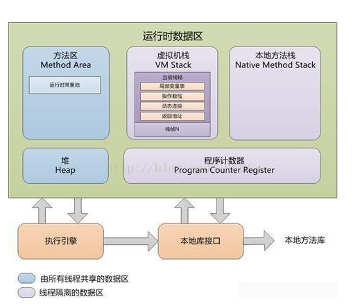

# JVM内存结构
## JVM内存划分

## JVM数据区简述
### PC寄存器/程序计数器（线程私有）
>程序计数器是一块较小的内存空间，它可以看作是当前线程所执行的字节码的行号指示器

### 本地方法栈（线程私有）
>本地方法栈（Native Method Stack）与虚拟机栈所发挥的作用是非常相似的，它们之间的区别不过是虚拟机栈为虚拟机执行Java方法（也就是字节码）服务，而本地方法栈则为虚拟机使用到的Native方法服务。

### JAVA堆（线程共享）
>所有的对象实例以及数组都要在堆上分配，是垃圾收集器管理的主要区域。这块是我们主要关注的模块，之后一些GC算法和GC处理器都是针对这块的

### 方法区（线程共享）
>它用于存储已被虚拟机加载的类信息、常量、静态变量、即时编译器编译后的代码等数据。其中运行时常量池是方法区的一部分。在后面对class文件进行介绍的时候会更加了解方法区中的知识。

### JAVA虚拟机栈（线程私有）
>生命周期与线程相同，即创建线程的同时创建的，用于存放**栈帧**。栈帧是一个方法在执行的时候存储局部变量表、操作数栈、操作数栈，动态链接、方法出口等信息。每个方法调用完后会将应的栈帧从JAVA虚拟机栈中出栈。如果线程请求的栈深度大于虚拟机的栈深度，会抛出SatckOverflowError异常。

#### 栈帧——局部变量表
>每一个栈帧有一个局部变量表，局部变量的数据在编译期就确认了，存储到了方法的Code属性中
	
#### 栈帧——操作数栈
>JVM底层字节码指令集是基于栈类型，所有的操作码都是对操作数栈上的数据进行操作，对于一个方法调用，JVM会建立一个操作数栈，以供计算，栈的深度在编译成class中已经确定，其深度属性存储在方法的Code属性中

#### 栈帧——动态链接
>每个栈帧内部包含了一个指向运行时常量池的引用来支持当前的代码实现动态链接	

### 参考博文
>1.https://www.cnblogs.com/dingyingsi/p/3760447.html  
>2.https://blog.csdn.net/luomingkui1109/article/details/72820232
