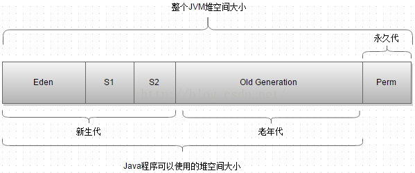

# 内存分配
## 前言
>之前介绍了JVM内存机制已经类加载，那么对于初始化的对象是分配在堆中的，但具体在堆的什么区域呢？这篇来简单了解下

## JVM堆空间划分
先来看下整体的JVM堆空间的划分，如下图  
  

根据上图，JVM如下划分：
>1.根据堆空间划分成三大区：**新生代、老年代、永久代**  
>2.新生代又划分成三个区:**Eden区、两个幸存区（From Survivor和To Survivor，有简称S1区和S2区）**

在了解了JVM堆的划分之后，在来了解两个知识：
>**新生代GC（Minor GC）**：指发生在新生代的垃圾收集动作，因为Java的对象大多数是朝生夕灭的，因此Minor GC非常频繁，回收速度也很快。  
>**老年代GC（Major GC）**：指发生在老年代的GC，出现了Major GC,经常会伴随至少一次的Minor GC（但非绝对的，在Parallel Scavenge收集器的收集策略里就有直接进行Major GC的策略选择过程）。Major GC的速度一般会比Minor GC慢10倍以上。  
>**Full GC:顾名思义，指发生在老年代和新生代的GC，速度很慢，需要Stop The World。**

关于这里上面提到的一些收集器后面文章会讲述。

### 对象生命周期所在内存分配
新对象产生时首先检查本地线程是否开启了缓存，是则存储在TLAB，否则去堆中寻找位置。这里不介绍TLAB，默认都分配在堆中。
>**一：对象优先分配在Eden区**。大多数情况下，对象在新生代Eden区中分配。 当Eden区没有足够空间进行分配时，虚拟机将发起一次Minor GC。发生Minor GC时，JVM会将存活的对象（如何判断是否存活，在后续文章中有介绍）放入其中一个Survivor区，另一个Survivor区大小是0，如果Survivor分配太小,Eden区的对象无法放入时，会通过分配担保机制提前转移到老年代。接着，等下次Eden区填满或其中一个Survivor被填满会再次发生Minor GC,然后会将存活的对象放到另一个大小为0的Survivor区，并将另一个Survivor区清空。也就是说，每发生一次Minor GC的时候，存活的对象会在S1区和S2区进行摇摆，要么全在S1区，要么全在S2区。至于为什么JVM会这么设计，应该是和垃圾回收算法中的复制算法有关，垃圾回收算法会在之后文章讲述。  
>**二：长期存活对象进入老年代**。为了能识别哪些对象应放在新生代，哪些放在老年代，虚拟机给每个对象定义了一个对象年龄，该年龄是对象在放入Eden区并经历一次Minor GC后仍然存活，在转移到Survivor区后，默认设置年龄为1，之后每经过一次Minor GC后年龄+1，到默认15岁后，虚拟机认为此对象比较稳定，将此对象转移到老年代中。这个默认15可以通过参数-XX：MaxTenuringThreshold设置。  
>**三：大对象直接进入老年代**。大对象就是需要连续内存空间的Java对象，比如很长的字符串或数组。  
>**四：动态对象年龄判定**。虚拟机不是完全根据第三点将对象存入老年代，如果Survivor区空间中相同年龄所有对象大小的总和大于Survivor空间的一半，那这些年龄大于或等于该年龄的对象会转移到老年代，不需要等到默认的15岁。

上述第一点提到了分配担保机制，什么是分配担保机制呢？在MinorGC之前，会先检查老年代最大可用空间是否可以容纳新生代所有对象（防止新生代全部晋升时放不下），如果可以容纳，则MinorGC可以安全执行。否则，检查是否允许担保失败，是则检查老年代最大可用空间是否大于历次晋升到老年代的对象的平均大小，是则尝试进行MinorGC；小于或者MinorGC失败，则会发起一次FullGC清理老年代。  
**针对上述情况的例子这里就不在罗列了，可以参考最后博客第3个**

### JVM内存配置参数
了解了上述内容后，这里讲下内存配置的参数，也就是哪些参数是配置方法区大小、堆大小、栈大小、新生代大小、Eden区大小等。  

|参数|描述|
|------|------|
|-Xmx|最大堆内存，**默认为物理内存的1/4**，但小于1G|
|-Xms|初始化堆内存，**默认为物理内存1/64**，但不超过1G|
|-Xmn|新生代的大小|
|-XX:SurvivorRatio|调整Eden：From(tO)的比率，**默认8:1** |
|-XX:PermSize|定义方法区的最小值,默认16M |
|-XX:MaxPermSize|定义方法区的最大值，默认64M，方法区域要使用的内存超过了其允许的大小时，抛出OutOfMemoryError|
|-Xss|线程栈的大小，每条线程都会分配一个栈，每个栈中有多个栈帧（每一个方法对应一个栈帧） |
|-XX:MinHeapFreeRatio|默认当空余堆内存小于最小堆内存的40%时，堆内存增大到-Xmx|
|-XX:MaxHeapFreeRatio|当空余堆内存大于最大堆内存的70%时，堆内存减少到-Xms|
|-XX:MaxTenuringThreshold|就是上面提到的所谓“年龄”，默认15|
|-XX:PretenureSizeThreshold|单位字节，知道大对象的标准|
|-XX:NewRatio|新生代与老年代的比例，默认3，即新生代占堆内存1/4，老年代占3/4|
|-XX:+PrintGC|输出GC的详细日志|
|-XX:+PrintGCTimeStamps|输出GC时间戳(以基准时间的形式)|
|-XX:+PrintHeapAtGC|在进行GC的前后打印出堆的信息|
|-Xloggc:/path/gc.log|日志文件的输出路径|
|-XX:+PrintGCApplicationStoppedTime|打印由GC产生的停顿时间 |

企业级开发一般配置（具体配置需要根据实际情况）
```java
<jvm-arg>-Xms2048m</jvm-arg>
<jvm-arg>-Xmx2048m</jvm-arg>
<jvm-arg>-Xmn512m</jvm-arg>
<jvm-arg>-XX:SurvivorRatio=8</jvm-arg>
<jvm-arg>-XX:MaxTenuringThreshold=15</jvm-arg>

可以看到，-Xms==-Xmx==2048m，年轻代大小-Xmn==512m，这样，年老代大小就是2048-512==1536m，这个比率值得记住，
在企业开发中，年轻代:年老代==1:3(默认)，而此时，我们配置的-XX:MaxTenuringThreshold=15（这也是默认值），
年轻代对象经过15次的复制后进入到年老代（关于这一点，在之后的GC机制中会说）

```

## 参考博文
>1.深入理解Java虚拟机  
>2.https://blog.csdn.net/sunny243788557/article/details/52796904  
>3.https://www.cnblogs.com/xiaoxi/p/6557473.html 
>4.https://www.cnblogs.com/LeonJ-Java/p/6497782.html  
>5.http://www.importnew.com/23035.html   
>6.http://www.cnblogs.com/java-zhao/p/5179836.html（其中Xms是最小堆内存，文章出错，应该是初始化堆内存）