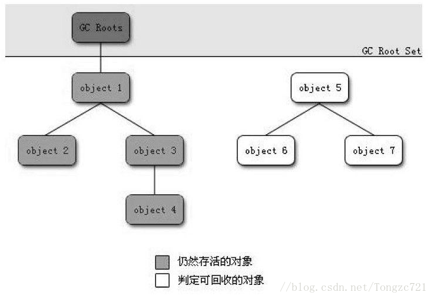
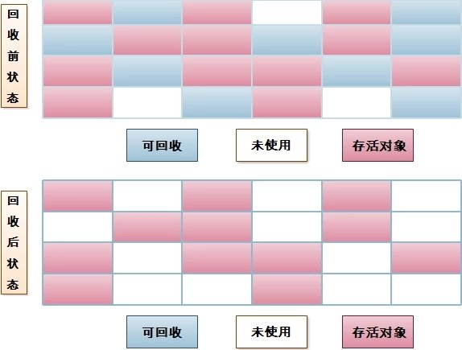
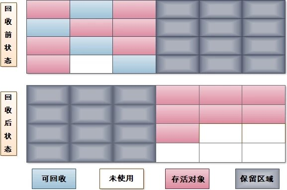
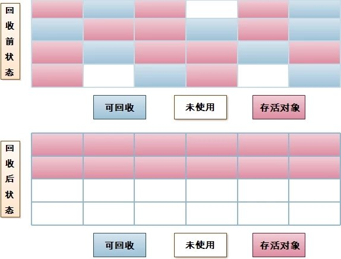

# 垃圾回收算法
## 前言
>之前介绍了堆内存相关内容，但遗留一个问题，就是对象在每次GC的时候，是如何判断对象到底是存活的还是非存活的。那么这篇就大致讲解一下  

## 哪些内存需要回收
对于那些对象是需要被GC回收的，这里我们了解一个算法：引用计数算法。  
>**引用计数算法**：给对象中添加一个引用计数器，每当有一个地方引用它时，计数器值就加1；当引用失效时，计数器值就减1；任何时刻计数器为0的对象就是不可能再被使用的。  


这个算法实现很简单，判定的效率也很高，但是，这个算法有个致命的问题，就是它很难解决对象之间相互循环引用的问题。来看下下面这段代码：
```java
	public class Test{
	    public static void main(String[] args) {
	        GCObject objA = new GCObject();
	        GCObject objB = new GCObject();  //1
	        objA.instance = objB;
	        objB.instance = objA;  //2
	        objA = null;
	        objB = null;  //3
	    }
	}
	class GCObject{
	    public Object instance = null;
	}
```
如果按照上述引用计数算法的话，上面注释1位置计数会从0变成1,2位置从1变成2,3位置从2变成1，那么这两个对象的计数都不为0，于是引用计数算法无法通知GC收集器回收它们。但是事实上，进行测试的时候是会进行回收的，那么说明JVM的GC算法并不是采用这种的来判断对象是否存活的。那么GC到底是怎么判断是否存活的呢（哪些内存需要回收？）。

## 根搜索算法(可达性分析算法)
GC判断对象是否存活采用的是一种新的算法，叫做**根搜索算法(可达性分析算法)**。它的处理方式就是，设立若干种根对象（总称为GC Roots），当任何一个根对象到某一个对象均不可达时，则认为这个对象是可以被回收的。看下下图：  
  
这个图我们就可以看明白了，对象object 5、 object 6、 object 7虽然互相有关联，但是它们到GC Roots是不可达的，所以它们将会被判定为是可回收的对象（其实也并非“非死不可”，后面会介绍为什么）。  
在Java语言中，可作为GC Roots的对象包括下面几种：
```java
1.虚拟机栈（栈帧中的本地变量表）中引用的对象。
2.方法区中类静态属性引用的对象。
3.方法区中常量引用的对象。
4.本地方法栈中JNI（即一般说的Native方法）引用的对象。
```
GC管理的主要区域是Java堆，一般情况下只针对堆进行垃圾回收。方法区、栈和本地方法区不被GC所管理,因而选择这些区域内的对象作为GC roots,被GC roots引用的对象不被GC回收。  
这里再介绍个概念——引用。在Java中引用分为**强引用、 软引用、 弱引用、 虚引用**4种，这4种引用强度依次逐渐减弱。
```java
强引用：就是指在程序代码之中普遍存在的，类似“Object obj=new Object（）”这类的引用，只要强引用还存在，垃圾收集器永远不会回收掉被引用的对象。  
软引用：是用来描述一些还有用但并非必需的对象。 对于软引用关联着的对象，在系统将要发生内存溢出异常之前，将会把这些对象列进回收范围之中进行第二次回收。 如果这次回收还没有足够的内存，才会抛出内存溢出异常。 在JDK 1.2之后，提供了SoftReference类来实现软引用。  
弱引用：也是用来描述非必需对象的，但是它的强度比软引用更弱一些，被弱引用关联的对象只能生存到下一次垃圾收集发生之前。 当垃圾收集器工作时，无论当前内存是否足够，都会回收掉只被弱引用关联的对象。 在JDK 1.2之后，提供了WeakReference类来实现弱引用。  
虚引用：也称为幽灵引用或者幻影引用，它是最弱的一种引用关系。 一个对象是否有虚引用的存在，完全不会对其生存时间构成影响，也无法通过虚引用来取得一个对象实例（拿到的是null）。 为一个对象设置虚引用关联的唯一目的就是能在这个对象被收集器回收时收到一个系统通知。 在JDK 1.2之后，提供了PhantomReference类来实现虚引用。
```
## 对象的自我拯救，真正的进行回收
上面说了，只有在可达性分析算法中不可达的对象才是被进行回收的对象，但并不是非死不可。因为在事实上，第一次不可达的时候是被判处缓刑，真正要宣告一个对象死亡，至少要经过两次标记的过程。如果对象在进行可达性分析后发现没有与GC Roots相连接的引用链，那它将会被第一次标记并且进行一次筛选，筛选的条件是此对象是否有必要执行finalize（）方法。 当对象没有覆盖finalize（）方法，或者finalize（）方法已经被虚拟机调用过，虚拟机将这两种情况都视为“没有必要执行”。  
如果这个对象被判定为有必要执行finalize（）方法，那么这个对象将会放置在一个叫做F-Queue的队列之中，并在稍后由一个由虚拟机自动建立的、 低优先级的Finalizer线程去执行它。 这里所谓的“执行”是指虚拟机会触发这个方法，但并不承诺会等待它运行结束，这样做的原因是，如果一个对象在finalize（）方法中执行缓慢，或者发生了死循环（更极端的情况），将很可能会导致F-Queue队列中其他对象永久处于等待，甚至导致整个内存回收系统崩溃。 finalize（）方法是对象逃脱死亡命运的最后一次机会，稍后GC将对F-Queue中的对象进行第二次小规模的标记，如果对象要在finalize（）中成功拯救自己——只要重新与引用链上的任何一个对象建立关联即可，譬如把自己（this关键字）赋值给某个类变量或者对象的成员变量，那在第二次标记时它将被移除出“即将回收”的集合；如果对象这时候还没有逃脱，那基本上它就真的被回收了。 从下面代码中我们可以看到一个对象的finalize（）被执行，但是它仍然可以存活。
```java
	public class FinalizeEscapeGC {  
	    public static FinalizeEscapeGC SAVE_HOOK = null;  
  
	    public void isAlive() {  
	        System.out.println("yes,i am still alive:)");  
	    }  
  
	    @Override  
	    protected void finalize() throws Throwable {  
	        super.finalize();  
	        System.out.println("finalize mehtod executed!");  
	        FinalizeEscapeGC.SAVE_HOOK = this;  
	    }  
  
	    public static void main(String[] args) throws Throwable {  
	        SAVE_HOOK = new FinalizeEscapeGC();  
	        // 对象第一次成功拯救自己  
	        SAVE_HOOK = null;  
	        System.gc();  
	        // 因为finalize方法优先级很低,所以暂停0.5秒以等待它  
	        Thread.sleep(500);  
	        if (SAVE_HOOK != null) {  
	            SAVE_HOOK.isAlive();  
	        } else {  
	            System.out.println("no,i am dead:(");  
	        }  
	        // 下面这段代码与上面的完全相同,但是这次自救却失败了  
	        SAVE_HOOK = null;  
	        System.gc();  
	        // 因为finalize方法优先级很低,所以暂停0.5秒以等待它  
	        Thread.sleep(500);  
	        if (SAVE_HOOK != null) {  
	            SAVE_HOOK.isAlive();  
	        } else {  
	            System.out.println("no,i am dead:(");  
	        }  
	    }  
	}  
  
	运行结果:  
	  
	finalize mehtod executed!  
	yes,i am still alive:)  
	no,i am dead:(  
```
从运行结果可以看出，SAVE_HOOK对象的finalize（）方法确实被GC收集器触发过，并且在被收集前成功逃脱了。另外一个值得注意的地方是，代码中有两段完全一样的代码片段，执行结果却是一次逃脱成功，一次失败，这是因为任何一个对象的finalize（）方法都只会被系统自动调用一次，如果对象面临下一次回收，它的finalize（）方法不会被再次执行，因此第二段代码的自救行动失败了。

## GC回收算法
>上面可达性分析算法让我们知道了哪些对象是需要被回收的，但是它显然还不能承担垃圾搜集的重任，因为我们在程序（程序也就是指我们运行在JVM上的JAVA程序）运行期间如果想进行垃圾回收，就必须让GC线程与程序当中的线程互相配合，才能在不影响程序运行的前提下，顺利的将垃圾进行回收。这就需要依靠垃圾回收器了，这介绍垃圾回收器之前，先来了解下垃圾回收算法，毕竟垃圾回收器是对垃圾回收算法的实现，那当然要知道这些算法啦。下面讲讲几种常见的垃圾回收算法

### 标记/清除算法
>标记/清除算法的做法是当堆中的有效内存空间（available memory）被耗尽的时候，就会停止整个程序（也被成为stop the world），然后进行两项工作，第一项则是标记，第二项则是清除。  
>**标记**：标记的过程其实就是，遍历所有的GC Roots，然后将所有GC Roots可达的对象标记为存活的对象。  
>**清除**：清除的过程将遍历堆中所有的对象，将没有标记的对象全部清除掉。

这两个步骤并不是特别复杂，也很容易理解。用通俗的话解释一下标记/清除算法，就是当程序运行期间，若可以使用的内存被耗尽的时候，GC线程就会被触发并将程序暂停，随后将依旧存活的对象标记一遍，最终再将堆中所有没被标记的对象全部清除掉，接下来便让程序恢复运行。效果图如下：    
  
标记/清除算法之所以说它是最基础的收集算法，是因为后续的收集算法都是基于这种思路并对其不足进行改进而得到的。 它的主要不足有两个：  
**1：效率问题**：标记和清除两个过程的效率都不高，要递归与全堆对象遍历，而且在进行GC的时候，需要停止应用程序，这会导致用户体验非常差劲  
**2.空间问题**：标记清除之后会产生大量不连续的内存碎片，空间碎片太多可能会导致以后在程中需要分配较大对象时（即需要一定的连续空间），且JVM就不得不维持一个内存的空闲列表，这又是一种开销。在分配数组对象的时候，寻找连续的内存空间会不太好找。无法找到足够的连续内存而不得不提前触发另一次垃圾回收。

了解了标记/清除算法之后，来看一下之后三个改进的算法。

### 复制算法
>复制算法将可用内存按容量划分为大小相等的两块，每次只使用其中的一块。 当这一块的内存用完了，就将还存活着的对象复制到另外一块上面，然后再把已使用过的内存空间一次清理掉。 这样使得每次都是对整个半区进行内存回收，内存分配时也就不用考虑内存碎片等复杂情况，只要移动堆顶指针，按顺序分配内存即可，实现简单，运行高效。(这就是JVM为什么存在两个空间大小一模一样的幸存区S1和S2了)  
  
  
同样的，复制算法也存在一定的问题：  
>**1.浪费了一半的内存空间**  
>**2.如果对象的存活率很高,假设100%存活，那么我们需要将所有对象都复制一遍，并将所有引用地址重置一遍。复制这一工作所花费的时间，在对象存活率达到一定程度时，将会变的不可 忽视。所以从以上描述不难看出，复制算法要想使用，最起码对象的存活率要非常低才行，而且最重要的是，我们必须要克服50%内存的浪费。**

### 标记整理算法
>标记整理算法的做法和标记清除法很类型，其中标记做法一样，只是这里的整理是移动所有存活的对象，且按照内存地址次序依次排列，然后将末端内存地址以后的内存全部回收。因此，第二阶段才称为整理阶段。  

  
标记整理算法缺点：**效率不如复制算法，因为标记整理算法中，除了要标记存活的对象，还要整理所有存活对象的引用地址。**  

### 分代算法
>其实分代算法不是什么新算法，而是根据之前所说的堆内存划分，对不同区域使用不同的算法，主要是上面三中算法。比如在新生代中，每次垃圾收集时都发现有大批对象死去，只有少量存活，那就选用复制算法，只需要付出少量存活对象的复制成本就可以完成收集。 而老年代中因为对象存活率高、 没有额外空间对它进行分配担保，就必须使用“标记—清理”或者“标记—整理”算法来进行回收。

## 总结
>此篇主要讲解如何判断对象需要被回收，以及垃圾回收算法，下一章将会讲解一些垃圾回收器，即对垃圾回收算法的实现。

## 参考博文
>1.深入理解java虚拟机  
>2.https://blog.csdn.net/sunny243788557/article/details/52796904  
>3.http://www.importnew.com/23035.html  