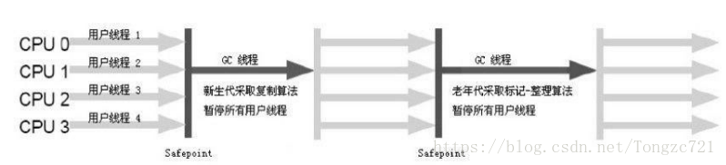
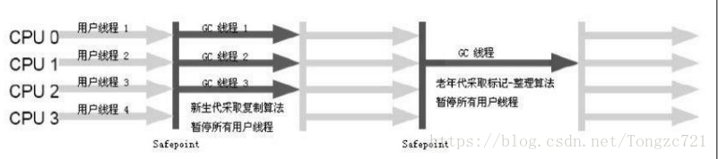
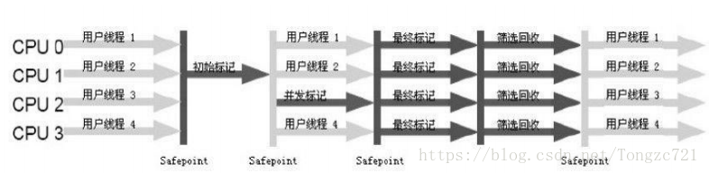
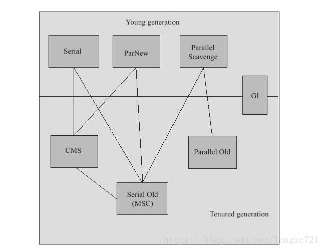

# 垃圾回收器
## 前言
>上篇将了垃圾回收算法，算法肯定要有实现的，而这篇就是讲对这些算法的通过编程来实现——垃圾回收器

## 概念
>先来了解几个知识点：  
>&emsp;&emsp;**1.并发：**指用户线程与垃圾收集线程同时执行（但不一定是并行的，可能会交替执行），用户程序在继续运行，而垃圾收集程序运行于另一个CPU上  
>&emsp;&emsp;**2.并行：**指多条垃圾收集线程并行工作，但此时用户线程仍然处于等待状态  
>&emsp;&emsp;**3.吞吐量：**吞吐量就是CPU用于运行用户代码的时间与CPU总消耗时间的比值，即吞吐量=运行用户代码时间/（运行用户代码时间+垃圾收集时间），虚拟机总共运行了100分钟，其中垃圾收集花掉1分钟，那吞吐量就是99%  

## 收集器分类
>根据垃圾收集线程的性质，主要将收集器分成**串行收集器、并行收集器、并发收集器**

### 串行搜集器（一个GC单线程，且会暂停用户程序）
>串行搜集器主要实现有**Serial收集器、serial old收集器**。  

  

**优点：**虽然是单线程收集, 但它却简单而高效, 在VM管理内存不大的情况下(收集几十M~一两百M的新生代), 停顿时间完全可以控制在几十毫秒~一百多毫秒内  
**缺点：**需要暂停用户线程，且停顿时间较长

#### Serial收集器（用于新生代，采用复制算法  ）
>Serial收集器Hotspot运行在Client模式下的默认新生代收集器, 它的特点是 只用一个CPU/一条收集线程去完成GC工作, 且在进行垃圾收集时必须暂停其他所有的工作线程。

#### Serial Old收集器（用于年老代，采用标记/整理算法）
>serial old收集器是Serial收集器的老年代版本, 同样是单线程收集器。

### 并行收集器
>并行搜集器主要实现有**ParNew收集器、Parallel Scavenge收集器和Parallel old收集器**。  

   

**优缺点：**由于存在线程切换的开销, ParNew在单CPU的环境中比不上Serial, 且在通过超线程技术实现的两个CPU的环境中也不能100%保证能超越Serial. 但随着可用的CPU数量的增加, 收集效率肯定也会大大增加(ParNew收集线程数与CPU的数量相同, 因此在CPU数量过大的环境中, 可用-XX:ParallelGCThreads参数控制GC线程数)

#### ParNew收集器（用于新生代，采用复制算法  ）
>ParNew收集器与前面Serial的多线程版本, 除使用多条线程进行GC外, 包括Serial可用的所有控制参数、收集算法、STW、对象分配规则、回收策略等都与Serial完全一样  

#### Parallel Scavenge（用于新生代，采用复制算法，更关注吞吐量）
>Parallel Scavenge也是使用复制算法, 也是并行多线程收集器. 但与其他收集器关注尽可能缩短垃圾收集时间不同, Parallel Scavenge更关注系统吞吐量:

#### Parallel old（用于年老代，采用标记/整理算法）
>Parallel Old是Parallel Scavenge老年代版本, 使用多线程和标记/整理算法, 吞吐量优先, 主要与Parallel Scavenge配合在 注重吞吐量及CPU资源敏感系统内使用。

### 并发收集器
>并发搜集器主要实现有**CMS收集器**。  
  

**优点：**真正意义上实现了应用程序与GC线程一起工作（一起是针对客户而言，而并不一定是真正的一起，有可能是快速交替）的搜集器。重视服务的响应速度，希望系统停顿时间最短，以给用户带来较好的体验  
**缺点：**在并发阶段，它虽然不会导致用户线程停顿，但是会因为占用了一部分线程（或者说CPU资源）而导致应用程序变慢，总吞吐量会降低。其次，由于CMS并发清理阶段用户线程还在运行着，伴随程序运行自然就还会有新的垃圾不断产生，这一部分垃圾出现在标记过程之后，CMS无法在当次收集中处理掉它们，只好留待下一次GC时再清理掉。这一部分垃圾就称为“浮动垃圾”。最后一个缺点就是CMS使用的是标记清除法，会产生空间碎片，从而无法找到足够大的连续空间来分配当前对象，不得不提前触发一次Full GC。

#### CMS收集器（用于年老代，采用标记/清除算法） 
CMS收集器是一款具有划时代意义的收集器, 一款真正意义上的并发收集器, 虽然现在已经有了理论意义上表现更好的G1收集器, 但现在主流互联网企业线上选用的仍是CMS  
CMS是一种以获取最短回收停顿时间为目标的收集器(CMS又称多并发低暂停的收集器), 基于”标记-清除”算法实现, 整个GC过程分为以下4个步骤:
>1、初始标记：需要暂停应用程序，快速标记存活对象。  
2、并发标记：恢复应用程序，并发跟踪GC Roots。  
3、重新标记：需要暂停应用程序，重新标记跟踪遗漏的对象。  
4、并发清除：恢复应用程序，并发清除未标记的垃圾对象。 

### 其他收集器（G1）
G1收集器（jdk1.7后出来，将整个Java堆划分为多个大小相等的独立区域（Region），虽然还保留有新生代和老年代的概念，但新生代和老年代不再是物理隔离的了，它们都是一部分Region（不需要连续）的集合。）  
  
对于G1这里就不详细介绍了，有兴趣自己去了解了解  

## 组合使用
上面介绍的6种垃圾搜集器都是针对不同内存区域设计的，我们需要给JVM的新生代和老年代选择相应的垃圾收集器，上面新生代垃圾搜集器有serial，ParNew和Parallel Scavenge三种，老年代垃圾搜集器有serial old，Parallel old和CMS三种。也就是说选择应该是3*3=9种，但是，事实上只有6种，因为有的垃圾搜集器由于具体实现方式等原因导致无法在一起工作。下图展示了可以组合工作的图。  
  
**请牢记这个图的组合！！**
>六种组合是：serial-CMS、serial-serial old、ParNew-CMS、ParNew-Seria old、Parallel Scavenge-Serial Old、Parallel Scavege-Parallel old

下面简单介绍下其中的几种组合：
> 1.serial-serial old：这个组合是最常见的，是client模式下默认的垃圾收集器组合，也可以使用参数-XX:+UseSerialGC强制开启。由于它实现相对简单，没有线程相关的额外开销（主要指线程切换与同步），因此非常适合运行于客户端PC的小型应用程序，或者桌面应用程序（比如swing编写的用户界面程序），以及我们平时的开发、调试、测试等。  
2.Parallel Scavenge-Parallel old：这个组合不常见，但是如果对吞吐量要求比较高或对停顿时间要求高的应用程序来说，是首选，这个组合是server模式下默认的组合，可以利用-XX:+UseParallelGC参数强制开启。  
3.ParNew-CMS（serial old）：这个组合在平常开发中不常见，但是在对相应时间要求较高的应用程序来说，是首选，这个组合使用-XX:+UseConcMarkSweepGC开启。这个组合在新生代使用并行，因此新生代GC速度非常快，老年代使用并发，因此老年代停顿时间较短，适用于一些需要长期运行且对相应时间有一定要求的后台程序，最典型的的就是WEB应用程序。  

## 收集器参数配置
垃圾收集器选择参数：

|参数|描述|
|------|------|
|UseSerialGC|开启此参数使用serial & serial old搜集器（client模式默认值）|
|UseParNewGC|开启此参数使用ParNew & serial old搜集器（不推荐）|
|UseConcMarkSweepGC|开启此参数使用ParNew & CMS（serial old为替补）搜集器|
|UseParallelGC|开启此参数使用parallel scavenge & parallel old搜集器（server模式默认值）|
|UseParallelOldGC|开启此参数在年老代使用parallel old搜集器（该参数在JDK1.5之后已无用）|

并行搜集器参数：  

|参数|描述|
|------|------|
|ParallelGCThreads|回收时开启的线程数。默认与CPU个数相等|
|GCTimeRatio|设置系统的吞吐量。比如设为99，则GC时间比为1/1+99=1%，也就是要求吞吐量为99%。若无法满足会缩小新生代大小|
|MaxGCPauseMillis|设置垃圾回收的最大停顿时间。若无法满足设置值，则会优先缩小新生代大小，仍无法满足的话则会牺牲吞吐量|

并发搜集器参数：  

|参数|描述|
|------|------|
|CMSInitiatingOccupancyFraction|触发CMS收集器的内存比例。比如60%的意思就是说，当内存达到60%，就会开始进行CMS并发收集|
|UseCMSCompactAtFullCollection|用于在Full GC后再执行一个碎片整理过程. 但内存整理是无法并发的, 内存碎片问题虽然没有了, 但停顿时间也因此变长了|
|CMSFullGCsBeforeCompaction|设置在几次CMS垃圾收集后，触发一次内存整理|

## JVM小工具
在${JAVA_HOME}/bin/目录下Sun/Oracle给我们提供了一些处理应用程序性能问题、定位故障的工具, 包含  
|bin|描述|功能|
|------|------|------|
|jps|打印Hotspot VM进程|VMID、JVM参数、main()函数参数、主类名/Jar路径|
|jstat|查看Hotspot VM 运行时信息|类加载、内存、GC[可分代查看]、JIT编译|
|jinfo|查看和修改虚拟机各项配置|-flag name=value|
|jmap|heapdump: 生成VM堆转储快照、查询finalize执行队列、Java堆和永久代详细信息|jmap -dump:live,format=b,file=heap.bin [VMID]|
|jstack|查看VM当前时刻的线程快照: 当前VM内每一条线程正在执行的方法堆栈集合|Thread.getAllStackTraces()提供了类似的功能|
|javap|查看经javac之后产生的JVM字节码代码|自动解析.class文件, 避免了去理解class文件格式以及手动解析class文件内容|
|jcmd|一个多功能工具, 可以用来导出堆, 查看Java进程、导出线程信息、 执行GC、查看性能相关数据等|几乎集合了jps、jstat、jinfo、jmap、jstack所有功能|
|**jconsole**|基于JMX的可视化监视、管理工具|可以查看内存、线程、类、CPU信息, 以及对JMX MBean进行管理|
|**jvisualvm**|JDK中最强大运行监视和故障处理工具|可以监控内存泄露、跟踪垃圾回收、执行时内存分析、CPU分析、线程分析…|

**所用工具中，jconsole和jvisualvm是使用最多的，功能最强大的。**  
>感兴趣的可以自行了解，或者参考JVM系列的ReadMe.md中提供的参考博客路径，里面有相应JVM工具使用和介绍
## 总结
>对所有垃圾回收器简单整理如下：  

| 搜集器 |类型|
|------|------|
|串行|serial（用于新生代，采用复制算法）、serial old（用于年老代，采用标记/整理算法）|
|并行|ParNew（用于新生代，采用复制算法）、Parallel Scavenge（用于新生代，采用复制算法，更关注吞吐量）、Parallel old（用于年老代，采用标记/整理算法）|
|并发|CMS收集器（用于年老代，采用标记/清除算法）|  

## 参考博文
>1.深入理解java虚拟机  
>2.http://www.importnew.com/23035.html  
>3.https://blog.csdn.net/Tongzc721/article/details/79702550
