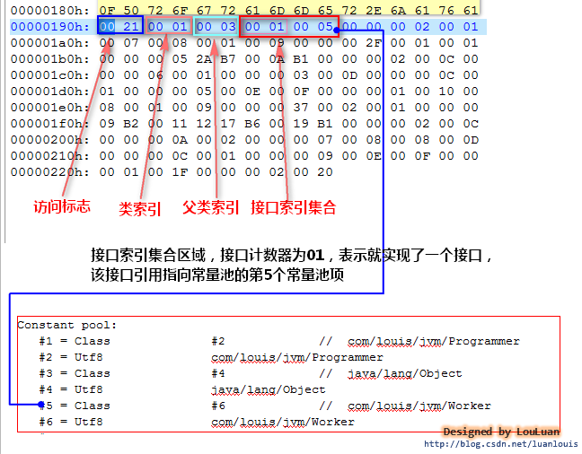

# Class文件结构之访问标志、类索引等
## 前言
>&emsp;&emsp;这篇简述常量池之后访问标志、类索引、父类索引和接口索引集合。结构如下图   
 
  
## 访问标志(access_flags)
&emsp;&emsp;从上图可知道访问标识长度为u2,由于u1是8位，所以访问标识在二进制中为16位，通过下面两张图我们就可以知道哪些访问标识对应的是哪个标志位了  


  
&emsp;&emsp;所以很明显，如果访问标志位是public则对应二进制为00000000 00000001对应16进行就是0x0001，如果是enum则是010000000 000000000对应16进制0x4000，如果是public和interface修饰的访问标识则对应二进制为00000010 00000001对应16进制0x0201,下图附上访问标志位对应的16进制表示  
  
&emsp;&emsp;举个例子：
```java 
package com.louis.jvm;

public class Simple {
 
}
```
&emsp;&emsp;上面在class文件中访问标识位是下图标红的，黄色的是常量池内容  
  
&emsp;&emsp;对应0x0021查表就知道是0x0001+0x0020即ACC_PUBLIC和ACC_SUPER,也可以对0x0021进行二进制转换，对应的二进制是00000000 00100001=>00000000 00100000 + 00000000 00000001查表也能得出是ACC_PUBLIC和ACC_SUPER。可以利用之前所述的命令来查看访问标识位是否正确，就不解释怎么验证了，自行可以尝试。  
##  类索引(this_class)
&emsp;&emsp;类索引的作用，就是为了指出class文件所描述的这个类叫什么名字。所以很明显，类名字是常量肯定在常量池里面，因此类索引长度u2，存储的值肯定是指向常量池中的一个索引了，这个索引就是CONSTANT_Class_info，而都知道CONSTANT_Class_info指向的这是CONSTANT_Utf8_info这个，通过这个就可以确定类名了，如上Simple，他的类索引为0x0001即指向常量池中的第一个常量池项，为方便可以通过javap -v Simple命令来查看可视化的内容，就能发现常量池第一个常量项就是CONSTANT_Class_info，表示的是com/louis/jvm/Simple"的类名。  
  
##  父类索引(super_class)
&emsp;&emsp;父类索引和类索引一样，也是指明该class类继承那个类，因为是单继承，所以父类索引和类索引流程是一样的，就不介绍了，可以自己去尝试下，Simple的父类索引指向的最后结果是java/lang/Object
## 接口索引集合(interfaces)
&emsp;&emsp;类可以不实现接口也可以实现多个接口，通过第一张图可以知道接口索引是由接口计数器和接口信息数据区组成，很明显计数器是记录类实现多少接口，而接口信息数据区是以接口索引为单位，每个接口索引代表一个接口的信息结构。接口索引也和父类索引以及类索引一样的流程，最终指向的是接口的名称，直接上例子吧。
```java 
public interface Worker{
	public void work();
}
public class Programmer implements Worker {
 
	@Override
	public void work() {
		System.out.println("I'm Programmer,Just coding....");
	}
}

```
&emsp;&emsp;打开Programmer.class文件后，主要看如下图所示内容，接口计数器长度u2,即下图为0x0001，为1个接口，接口索引流向和类索引一样。  
  
