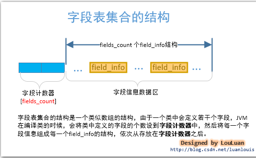
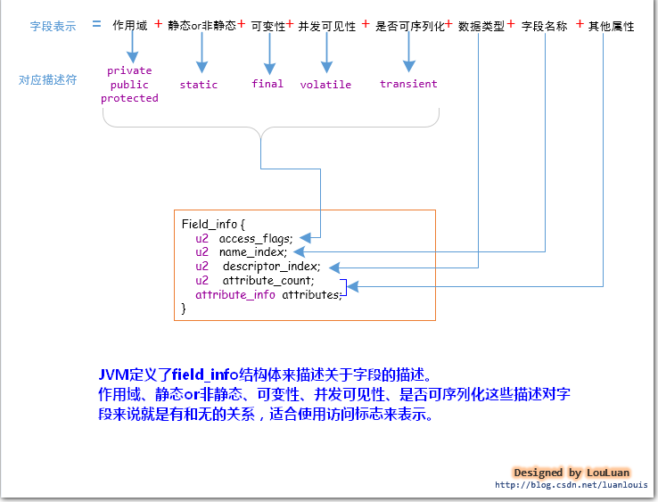
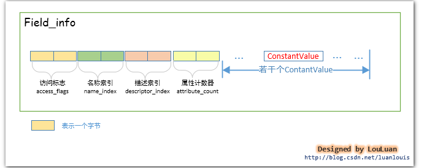
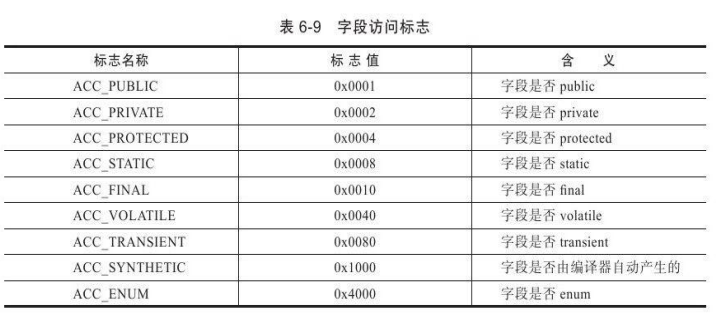
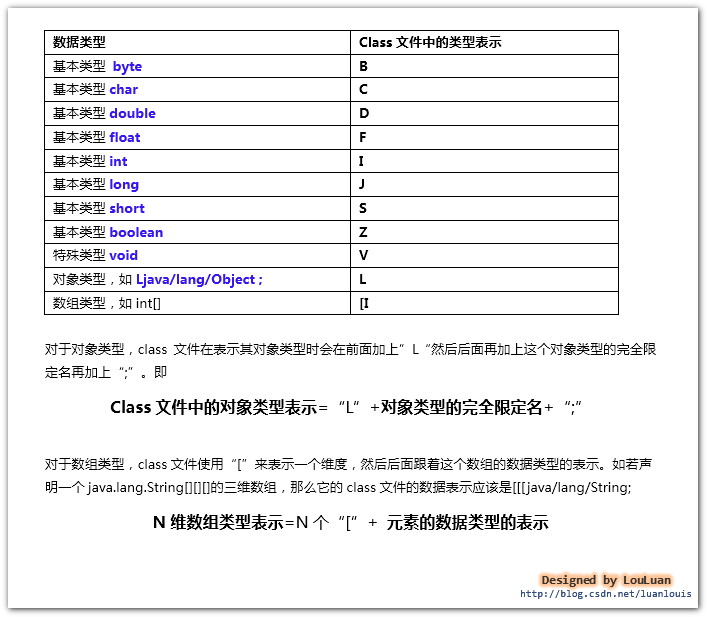
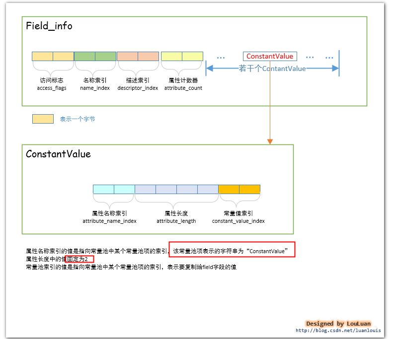
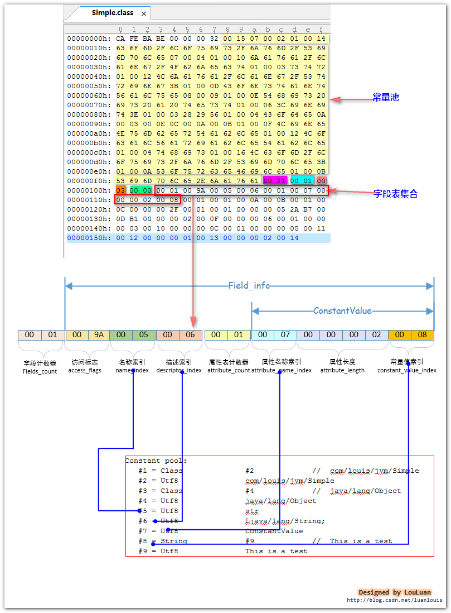
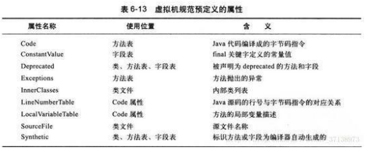

# 字段表集合
## 前言
>&emsp;&emsp;字段表集合指由若干个字段表（field_info）组成的集合，位于接口索引集合之后。这里所讲的字段是指在类中定义的**静态或者非静态的变量**，而不是在类中的方法内定义的变量。请注意区别。结构如下图  

  
## field_info结构
&emsp;&emsp;字段计数器就不在详细说了，和接口计数器一样，长度为u2，表示字段信息数据区中有多少个field_info，field_info结构如下图：
  
 
&emsp;&emsp;有没有发现，field_info结构和常量池中CONSTANT_Fieldref_info这个常量项有些信息是相同的，主要是CONSTANT_Fieldref_info不仅包含了类或接口中定义的字段，还包括在字节码中使用到的字段信息，而这里为什么field_info结构中不把name_index和descriptor_index合并成fieldref_index来指向CONSTANT_Fieldref_info呢，具体为什么我也没找到原因，网上也有说可能是设计上的失误吧。（就不纠结了）  
&emsp;&emsp;那下面就对字段表集合中最重要的field_info结构进行介绍下，其中很多内容和常量池中CONSTANT_Fieldref_info相似，所以会比较好理解，有些地方就不重复细说了。
### 访问标志
&emsp;&emsp; 和类索引之前的访问标识同一个道理，只是这个形容的不是类，而是字段，理解之前的访问标志，这里就很容易明白了，到时候查表就可以得到对应的访问标志了。  
  
 	
### 名称索引和描述索引
&emsp;&emsp; 也和之前的一样，名称索引即字段的名称，长度u2，指向常量池中对应的常量项，描述索引就是字段的类型，长度也是u2，同样指向常量池中的相应常量项  
 	
### 属性表集合
&emsp;&emsp;属性表集合是由属性计数器和若干个属性组合而成，计数器就不解释了。  
&emsp;&emsp;在对field进行赋值的时候，一般有如下两种：
```java
public static final int MAX=100;  
public  int count=0;  
```
&emsp;&emsp;对于虚拟机而言，上述的两个field字段赋值的时机是不同的：
> 1.对于非静态（即无static修饰）的field字段的赋值将会出现在实例构造方法<init>()中  
2.对于静态的field字段，有两个选择：1、在静态构造方法<cinit>()中进行；2 、使用ConstantValue属性进行赋值  

&emsp;&emsp;如果使用final和static同时修饰一个field字段，并且这个字段是基本类型或者String类型的，那么编译器在编译这个字段的时候，会在对应的field_info结构体中增加一个ConstantValue类型的结构体，在赋值的时候使用这个ConstantValue进行赋值；如果该field字段并没有被final修饰，或者不是基本类型或者String类型，那么将在类构造方法<cinit>()中赋值。  
&emsp;&emsp;对于上述的public static final init MAX=100;   javac编译器在编译此field字段构建field_info结构体时，除了访问标志、名称索引、描述符索引外，会增加一个ConstantValue类型的属性表。
  
### 例子
```java 
public class Simple {  
  
    private  transient static final String str ="This is a test";  
}  
```
&emsp;&emsp;对上面的java进行编译成class文件后，查看class中内容，借助javap -v Simple命令来帮助验证，如下  
  
>流程如下：  
>1. 字段计数器为0x0001，表示该类中只定义了一个field字段  
>2. 访问标识是0x009A,对应二进制为00000000 10011010，查表可知是00000000 10000000（ACC_TRANSIENT）、00000000 00010000（ACC_FINAL）、00000000 00001000（ACC_STATIC）、00000000 00000010（ACC_PRIVATE）修饰  
>3. 名称索引是0x0005，执行常量池中第5个常量项，为"str"  
>4. 描述索引0x0006，指向常量池第6个常量项"Ljava/lang/String;"  
>5. 属性计数器0x0001表示field_info只有一个属性表  
>6. 属性索引0x0007执行常量池中第7个常量项，为"ConstantValue",说明属性表的类型是ConstantValue类型的  
>7. 属性长度0x0002,说明长度为2，因为属性表类型是ConstantValue，它的长度是固定值2  
>8. 常量值索引0x0008,指向常量池中第8个常量项，是CONSTANT_String_info类型的，即“This is a test”
### 附其他属性表类型对照
&emsp;&emsp;上面讲述的属性索引对应的是ConstantValue类型，对应其他类型可以自行了解，这里附上其他类型说明
  
