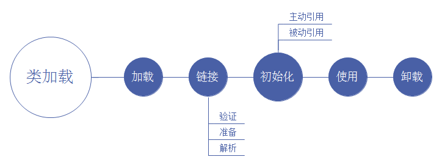
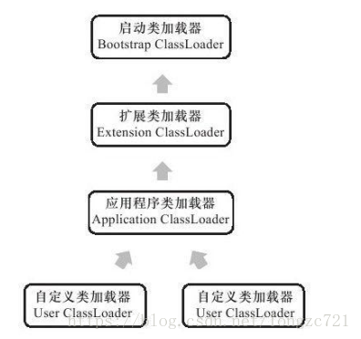
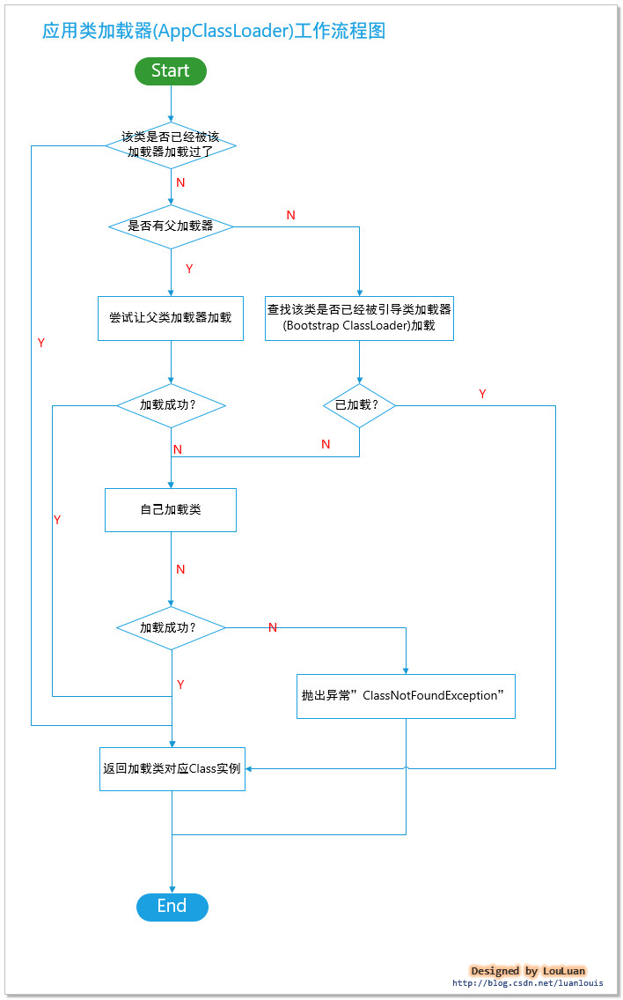

# 类加载器与加载过程
## 前言
>在知道了class字节码文件结构和JVM内存模型后，需要一个过程将字节码文件加载到内存。这节就是简述如何将class文件加载到内存。

## 类加载机制
>JVM把Class文件中的类描述数据从文件加载到内存，并对数据进行校验、转换解析、初始化，使这些数据最终成为可以被JVM直接使用的Java类型，这个说来简单但实际复杂的过程叫做JVM的类加载机制。  
>**类加载整个生命周期：加载、链接（验证、准备、解析）、初始化、使用、卸载**。如下图



### 加载
加载主要依靠类加载器ClassLoader来完成，对于类加载器后续介绍，先来了解下加载的使命。
>加载需要完成3件事情：  
**1**.通过一个类的全限定名来获取定义此类的二进制字节流  
**2**.将这个字节流所代表的静态存储结构转为方法区的运行时数据结构  
**3**.在内存中生成一个代表这个类的java.lang.Class对象，作为方法区这个类的各种数据的访问入口

### 链接
>链接就是将Java类的二进制代码合并到java的运行状态中的过程。主要包含验证、准备和解析。

#### 验证：  
确保Class文件的字节流中包含的信息符合当前虚拟机要求，且不会危害虚拟机自身安全。大致上分4个阶段进行验证：**文件格式验证、元数据验证、字节码验证和符合引用验证**。  
>**1、文件格式验证**：例如验证文件是否是魔数0xCAFFBABE开头、主次版本号是否在此JVM处理范围内、常量池中是否有不被支持的常量类型、是否存在指向不存在的常量或不符合类型常量的索引、CONSTANT_Utf8_info类型常量是否有不符合UTF8编码等  
**2、元数据验证**：对字节码信息进行语义分析，保证不存在不符合Java语言规范的元数据信息，如该类是否继承了不被允许继承的final修饰的类、继承抽象类是否实现了其他所有抽象方法等。  
**3、字节码验证**：对类的方法体进行校验。例如校验操作数栈的数据类型和指令代码序列能配合上，如操作栈放了int类型数据，使用却按照long类型加载到本地变量表中  
**4、符合引用验证**：将符号引用转化为直接引用是进行验证，如通过字符串描述的全限定名是否能找到对应的类、符号引用中的类、字段、方法的访问性是否可被当前类访问等。  
	
#### 准备：
>准备阶段是正式为类变量分配内存（方法区）并设置类变量初始值的阶段。注意：这里说的内存分配指的是被static修饰的变量，并不包括实例变量，实例变量是在对象实例化时随着对象一起分配在java堆中。 例如static int a=3，在此阶段会a被初始化为0，其他数据类型参考成员变量声明。 

#### 解析：
解析是虚拟机将常量池内的符号引用替换为直接引用的过程。例如"aaa"为常量池的一个值，直接把"aaa"替换成存在于内存中的地址。
>**符号引用**：符号引用以一组符号来描述所引用的目标，符号可以是任何形式的字面量。例如之前Class文件中CONSTANT_CLASS_inf代表的是Class的符号引用。  
>**直接引用**：直接引用可以是直接指向目标的指针、相对偏移量或是一个能间接定位到目标的句柄。直接引用是与虚拟机实现的内存布局相关的，如果有了直接引用，那么引用的目标必定已经在内存中存在。

#### 初始化：
初始化是真正开始执行类中定义的JAVA程序代码（字节码）。初始化阶段是执行类构造器 &lt;clinit &gt;（）方法的过程。  
>**&lt;clinit&gt;（）方法：**是由编译器自动收集类中所有类变量的赋值动作和静态语句块（static块）中的语句合并产生的。收集按照顺序收集，所有静态语句块中只能访问到定义在静态语句块之前的变量。虚拟机会保证子类的clinit执行前，其父类的clinit执行完毕，所有虚拟机中第一个clinit是Object类。因此父类中定义的静态变量要优先于子类的静态变量进行赋值操作。**当然，如果接口和类中没有静态的东西，虚拟机可以不为这个类生成clinit方法，同时一个类只会加载一次clinit**

### 使用和卸载
>使用就是正常使用，卸载则是GC吧无用的对象从内存中卸载，对应GC内容后续文章会单独讲解，GC也是JVM中重点内容之一。

### 初始化机制深入
刚才上述大致介绍了下初始化，这里在深入一点，因为初始化是类加载的最后一步，初始化阶段之后就可以使用了。上面大致说了下类的初始化的主要工作是为静态变量赋程序设定的初值。**如static int a = 100;在准备阶段，a被赋默认值0，在初始化阶段就会被赋值为100。**,那么那些情况才会进行初始化呢，在JVM中规定了**有且只有五种情况会对类进行初始化**，这五种情况称为主动引用，反之，未初始化的称为被动引用，下面看一下主动引用和被动引用有哪些，如下  
>**1、主动引用，发生类初始化过程**  
>&emsp;&emsp;①new一个对象，或调用类的静态成员（除了final常量）和静态方法  
>&emsp;&emsp;②通过java.lang.reflect包的方法对类进行反射调用的时候，如果类没有进行过初始化，则要首先进行初始化。    
>&emsp;&emsp;③虚拟机开启时，用户需要指定一个主类，即main方法所在类被提前初始化  
>&emsp;&emsp;④当初始化一个类的时候，如果发现其父类没有进行过初始化，则首先触发父类初始化  
>&emsp;&emsp;⑤使用jdk1.7的动态语言支持时，如果一个java.lang.invoke.MethodHandle实例最后的解析结果REF_getStatic、REF_putStatic、RE_invokeStatic的方法句柄，并且这个方法句柄对应的类没有进行初始化，则需要先触发其初始化。  
>**2、被动引用，不会发生类初始化过程**  
>&emsp;&emsp;①当访问一个静态变量时，只有真正声明这个类变量的类才会初始化。（子类调用父类的静态变量，只有父类初始化，子类不被初始化）  
>&emsp;&emsp;②通过数组定义类引用，不会触发此类的初始，因为是数组new，而类没有被new   
>&emsp;&emsp;③final修饰的静态常量不会触发此类的初始化，因为在编译阶段就会被存入调用类的常量池中（即直接指向方法区该类常量池中对应的这个常量），不会引用到定义常量的类，这是一个特例，需要特别记忆，不会触发类的初始化！


**被动引用例子1（符合被动引用第1点）：**  
```java
//父类
public class SuperClass {
	//静态变量value
	public static int value = 666;
	//静态块，父类初始化时会调用
	static{
		System.out.println("父类初始化！");
	}
}
 
//子类
public class SubClass extends SuperClass{
	//静态块，子类初始化时会调用
	static{
		System.out.println("子类初始化！");
	}
}
 
//主类、测试类
public class NotInit {
	public static void main(String[] args){
		System.out.println(SubClass.value);
	}
}

输出结果：
父类初始化！
666
````

**被动引用例子2（符合被动引用第2点）：**  
```java
/父类
public class SuperClass {
	//静态变量value
	public static int value = 666;
	//静态块，父类初始化时会调用
	static{
		System.out.println("父类初始化！");
	}
}
 
//主类、测试类
public class NotInit {
	public static void main(String[] args){
		SuperClass[] test = new SuperClass[10];
	}
}

没有任何输出
```

**被动引用例子3（符合被动引用第3点）：**  
```java
//常量类
public class ConstClass {
	static{
		System.out.println("常量类初始化！");
	}
	
	public static final String HELLOWORLD = "hello world!";
}
 
//主类、测试类
public class NotInit {
	public static void main(String[] args){
		System.out.println(ConstClass.HELLOWORLD);
	}
}

输入结果：
hello world!
```

### 类加载器/双亲委派机制  
#### 类加载器
>之前介绍了，类加载器是在类加载的阶段实现的，是加载中三步的第一步“通过一个类的全限定名来获取定义此类的二进制字节流”的实现动作。对于任何一个类，都需要由加载器来确定其在JVM中的唯一性，，也就是说，一个类如果是不同类加载器加载的，那么他们是不相同的。
下面通过一个例子就能很好理解了
```java
/**
* 这个例子ClassLoaderTest类分别由系统加载和自定义加载器加载，
* 然后使用instanceof来判断两个加载进来的对象实例是不是属性
* com.tong.test.ClassLoaderTest类型的对象。
**/
public class ClassLoaderTest {  
	public static void main(String[] args)throws Exception{
        ClassLoader myLoader=new ClassLoader(){
            @Override
            public Class<?>loadClass(String name)throws ClassNotFoundException{
                try{
                    String fileName=name.substring(name.lastIndexOf(".")+1)+".class";
                    InputStream is=getClass().getResourceAsStream(fileName);
                    if(is==null){
                        return super.loadClass(name);
                    }
                    byte[]b=new byte[is.available()];
                    is.read(b);
                    return defineClass(name,b,0,b.length);
                }catch(IOException e){
                    throw new ClassNotFoundException(name);
                }
            }
        };
        Object obj=myLoader.loadClass("com.tong.test.ClassLoaderTest").newInstance();
        System.out.println(obj.getClass());
        Object obj2 = new ClassLoaderTest();
        System.out.println(obj2.getClass());
        System.out.println(obj instanceof com.tong.test.ClassLoaderTest);
        System.out.println(obj2 instanceof com.tong.test.ClassLoaderTest);
    }
}

输出结果：
class com.tong.test.ClassLoaderTest
class com.tong.test.ClassLoaderTest
false
true
```

##### 双亲委派机制  
从JVM角度讲，类加载器分为两种：**1.启动类加载器（C++实现）**，**2.其他类加载器**，Java开发来讲，可细分如下：  
>**一、启动类加载器Bootstrap ClassLoader** ：又称**引导类加载器**，这个类负责将&lt;JAVA\_HOME&gt;\lib目录中类库加载到虚拟机内存中，启动类加载器无法被JAVA程序直接引用 
>**二、扩展类加载器Extension ClassLoader** ：这个类加载器由sun.misc.Launcher$ExtClassLoader实现，负责加载&lt;JAVA\_HOME&gt;\lib\ext目录中类库  	
>**三、应用程序类加载器Application ClassLoader** ：这个类加载器由sun.misc.Launcher$AppClassLoader实现，这个类是类加载器ClassLoader中getSystemClassLoader()返回的。负责加载用户类路径下指定的类库

#### 类加载器关系  
  
上图来源于深入理解java虚拟机，看图可能会有点点误导，因为启动类加载器是C++实现，扩展类是不存在父类的，下图模型更好理解  
  

#### 双亲委派工作过程  
如果一个类加载器收到了类加载的请求，它首先不会自己尝试加载这个类，而是把这个请求委派给父类加载器去完成，每一层都是这样，因此所有的加载请求都会到启动类加载器Bootstrap ClassLoader中，只有父类加载器反馈自己无法加载这个请求（它搜索范围中没有找到需要的类）时，子加载器才会尝试自己去加载。  
>**具体流程**：对于某个特定的类加载器而言，应该为其指定一个父类加载器，当用其进行加载类的时候：  
&emsp;&emsp;1. 委托父类加载器帮忙加载；  
&emsp;&emsp;2. 父类加载器加载不了，则**查询**引导类加载器有没有加载过该类；  
&emsp;&emsp;3. 如果引导类加载器没有加载过该类，则当前的类加载器应该自己加载该类；  
&emsp;&emsp;4. 若加载成功，返回 对应的Class<T> 对象；若失败，抛出异常“ClassNotFoundException”。  
&emsp;&emsp;**请注意：**双亲委派模型中的"双亲"并不是指它有两个父类加载器的意思，一个类加载器只应该有一个父加载器。所谓的双亲是父加载器和引导类加载器。  

上面文字描述的如果看不懂不要紧，作为程序猿，估计看代码比看文字更好理解，直接上代码如下（注释已经很明白了，代码为ClassLoader中的loadClass方法）：
```java
//提供class类的二进制名称表示，加载对应class，加载成功，则返回表示该类对应的Class<T> instance 实例  
public Class<?> loadClass(String name) throws ClassNotFoundException {  
    return loadClass(name, false);  
}  

protected Class<?> loadClass(String name, boolean resolve)  
    throws ClassNotFoundException  
{  
    synchronized (getClassLoadingLock(name)) {  
        // 首先，检查是否已经被当前的类加载器记载过了，如果已经被加载，直接返回对应的Class<T>实例  
        Class<?> c = findLoadedClass(name);  
            //初次加载  
            if (c == null) {  
            long t0 = System.nanoTime();  
            try {  
                if (parent != null) {  
                    //如果有父类加载器，则先让父类加载器加载  
                    c = parent.loadClass(name, false);  
                } else {  
                    // 没有父加载器，则查看是否已经被引导类加载器加载，有则直接返回  
                    c = findBootstrapClassOrNull(name);  
                }  
            } catch (ClassNotFoundException e) {  
                // ClassNotFoundException thrown if class not found  
                // from the non-null parent class loader  
            }  
            // 父加载器加载失败，并且没有被引导类加载器加载，则尝试该类加载器自己尝试加载  
            if (c == null) {  
                // If still not found, then invoke findClass in order  
                // to find the class.  
                long t1 = System.nanoTime();  
                // 自己尝试加载  
                c = findClass(name);  
  
                // this is the defining class loader; record the stats  
                sun.misc.PerfCounter.getParentDelegationTime().addTime(t1 - t0);  
                sun.misc.PerfCounter.getFindClassTime().addElapsedTimeFrom(t1);  
                sun.misc.PerfCounter.getFindClasses().increment();  
            }  
        }  
        //是否解析类   
        if (resolve) {  
            resolveClass(c);  
        }  
        return c;  
    }  
}  
```

流程图如下：  
   

#### 优势
>**使用双亲委派机制好处**：java类随着它的类加载器一起具备了一种带有优先级的层次关系。例如类java.lang.Object，它存放在rt.jar中，无论哪个类加载器要加载这个类，最终都会委派给启动类加载器进行加载，因此Object类在程序的各种类加载器环境中都是同一个类。相反，如果用户自己写了一个名为java.lang.Object的类，并放在程序的Classpath中，那系统中将会出现多个不同的Object类，java类型体系中最基础的行为也无法保证，应用程序也会变得一片混乱。  
>
## 双亲委派机制过程个人总结:
**对于自定义类来说（假设定义了一个Demo类），JVM加载这个类的时候是调用launcher.getClassLoader() ，返回的是AppClassLoader应用类加载器实例，然后调用的是loadClass方法，这个方法具体步骤是**：  
>1、首先从方法区（对应加载器控制的那块区域）中查找是否加载了此Demo类。如果有则直接返回这个类的Class实例   
>2、如果没有加载，判断此加载器有没有父类，如果有父类，调用父类的loadClass去加载（递归）,而AppClassLoader对应的父类是ExtClassLoader扩展类加载器，首先查询：findLoadedClass，如果这个ExtClassLoader类加载器找到就返回，没有找到就调用findBootstrapClassOrNull方法（因为ExtClassLoader父类是null），去BootstrapClassLoader启动器中查找有没有被加载过，如果没有，那么会进入if（c==null）中，ExtClassLoader会调用findClass自己去尝试加载，如果加载不了，返回null，那AppClassLoader自己调用findClass去加载，如果自己也加载不了，就报错ClassNotFoundException。  

**重点思路：递归思想**

## 参考博文
>1.深入理解Java虚拟机  
>2.https://www.cnblogs.com/qiuyong/p/6407418.html?utm_source=itdadao&utm_medium=referral  
>3.https://blog.csdn.net/zhangliangzi/article/details/51319033  
>4.https://blog.csdn.net/Tongzc721/article/details/80833083  
